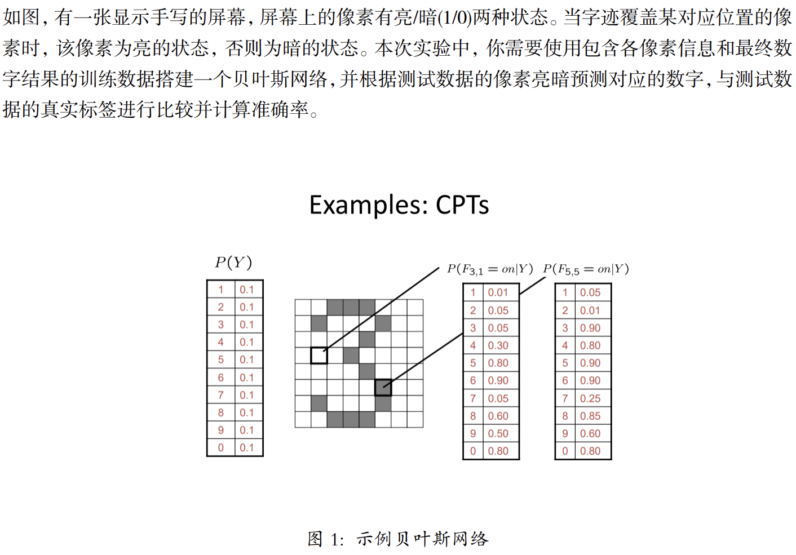
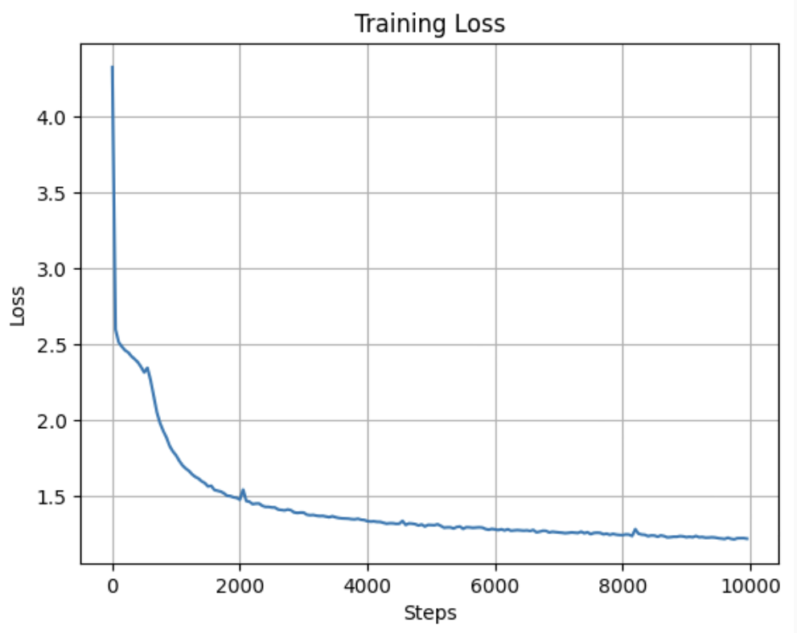
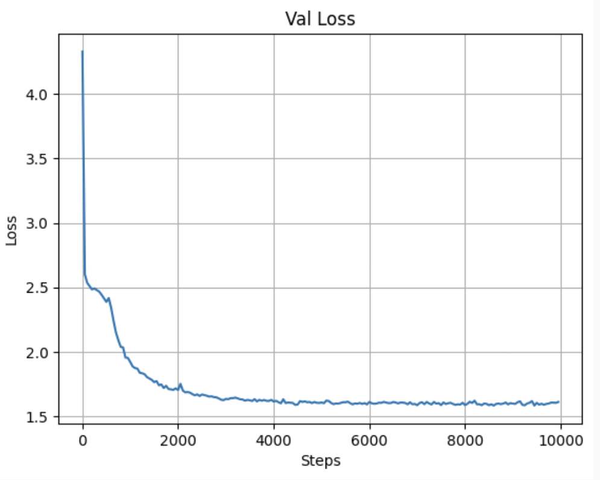
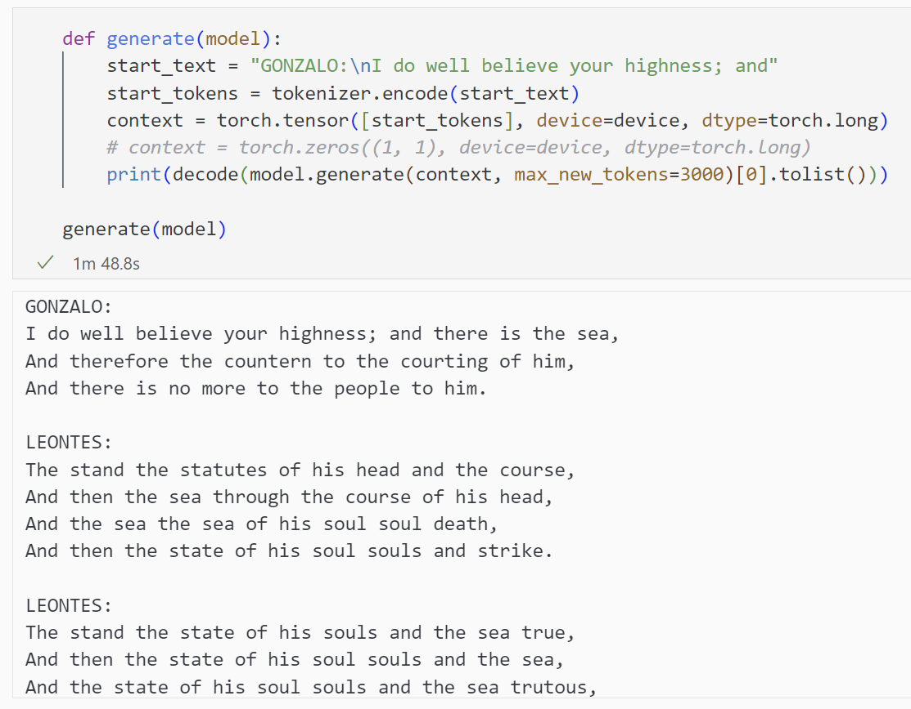

# Lab2 实验报告

<p style="text-align:right">李远航 PB20000137</p>

## 贝叶斯网络手写数字识别

### 1. 实验内容



### 2. 实验原理

朴素贝叶斯提前假设：条件独立性，即
$$
P(A,B|Y) = P(A|Y) \cdot P(B|Y)
$$
通过对贝叶斯公式进行变形，得到
$$
P(Y=c_k|X = x) = \frac{P(X=x|Y=c_k)\cdot P(Y=c_k)}{\sum_k P(X=x|Y=c_k)\cdot P(Y=c_k)}
$$
又根据独立性假设：
$$
P(X=x|Y=c_k)=\prod_{i=1}^n P(x_i|Y=c_k)
$$
代入上述表达式，可以得到分类：
$$
y = argmax_{c_k} P(Y = c_k) \prod_j P(X=x_j|Y=c_k)
$$

### 3. 具体实现

- 根据频次，分别计算先验概率，条件概率

  ```python
  # Calculate prior probability
  for label in labels:
      self.labels_prior[label] += 1
  
  # Calculate conditional probability
  for i in range(n_samples):
      label = labels[i]
      for pixel in range(self.n_pixels):
          pixel_value = pixels[i, pixel]
          self.pixels_prior[pixel, pixel_value] += 1
          self.pixels_cond_label[pixel, pixel_value, label] += 1
         
  # Normalize conditional probability
  for pixel in range(self.n_pixels):
      for value in range(self.n_values):
          self.pixels_prior[pixel, value] /= n_samples
          for label in range(self.n_labels):
              self.pixels_cond_label[pixel, value, label] /= self.labels_prior[label]
  
  self.labels_prior /= n_samples
  ```

- 根据朴素贝叶斯算法，进行预测：

  ```python
  for i in range(n_samples):
      pixel_values = pixels[i]
      label_scores = np.zeros(self.n_labels)
      
      for label in range(self.n_labels):
          label_scores[label] = self.labels_prior[label]
          for pixel in range(self.n_pixels):
              pixel_value = pixel_values[pixel]
              label_scores[label] *= self.pixels_cond_label[pixel, pixel_value, label]
              
      labels[i] = np.argmax(label_scores)
  ```

### 4. 实验结果

```bash
$ python .\Baysian-network.py
test score: 0.843800
```

可以看到，基本完成了对数字的识别

## 利用 K-means 实现图片压缩

### 1. 实验内容


### 2. 实验原理

- 随机选取 k 个样本作为初始的聚类中心
- 计算每个样本与各个聚类中心之间的距离，把每个样本分配给距离其最近的聚类中心
- 对于每一个新的聚类，重新距离每个样本之和最小的计算聚类中心
- 重复上述两步，直到中心不再移动

### 3. 具体实现

- 初始化（已在框架中实现）

  ```python
  n, d = points.shape
  centers = np.zeros((self.k, d))
  for k in range(self.k):
      random_index = np.random.choice(n, size=10, replace=False)
      centers[k] = points[random_index].mean(axis=0)
  ```

- 重新分配聚类

  ```python
  for i in range(n_samples):
      distances = np.linalg.norm(points[i] - centers, axis=1)
      labels[i] = np.argmin(distances)
  ```

- 计算新的聚类中心

  ```python
  new_centers = np.zeros_like(centers)
  for k in range(self.k):
      cluster_points = points[labels == k]
      if len(cluster_points) > 0:
          new_centers[k] = np.mean(cluster_points, axis=0)
      else:
          new_centers[k] = centers[k]
  ```

- 循环

  ```python
  for _ in range(self.max_iter):
      labels = self.assign_points(centers, points)
      new_centers = self.update_centers(centers, labels, points)
      if np.all(centers == new_centers):
          break
      centers = new_centers
  ```

### 4. 实验结果


上方从左到右依次为原图，$k =2$，$k=4$，$k=8$，$k=16$，$k=32$ 时候的结果，下方为压缩后文件的体积，可以看到K-means算法，顺利完成图像的压缩任务


## 深度学习

==~~_感谢gpt对本实验的大力支持_~~==

### 1. 实验内容


### 2. 实验原理


### 3. 具体实现

- `char_tokenizer`

  实现对数据的编码操作，使用最简单的方式，按照序号编码

  ```python
  class char_tokenizer:
      def __init__(self, corpus: List[str]):
          self.corpus = corpus
          self.n_vocab = len(corpus)
          self.char2int = {char: i for i, char in enumerate(corpus)}
      def encode(self, string: str):
          return [self.char2int[char] for char in string]
      def decode(self, codes: List[int]):
          return ''.join([self.corpus[code] for code in codes])
  
  ```

- `Head`

  表示一个注意力头，注意力头接收输入张量，并根据输入计算注意力权重，并将其应用于输入张量的不同位置

  ```python
  class Head(nn.Module):
      def __init__(self, head_size):
          super().__init__()
          self.Key = nn.Linear(head_size, head_size)
          self.Query = nn.Linear(head_size, head_size)
          self.Value = nn.Linear(head_size, head_size)
          self.register_buffer("tril", torch.tril(
      		torch.ones(block_size, block_size)))
      def forward(self, inputs):
          batch, time, n_embd = inputs.shape
          keys = self.Key(inputs)
          queries = self.Query(inputs)
          values = self.Value(inputs)
          scores = torch.matmul(queries, keys.transpose(1, 2))
          scores = scores.masked_fill(
              self.tril[:time, :time] == 0, float('-inf'))
          attention_weights = F.softmax(scores, dim=-1)
          out = torch.matmul(attention_weights, values)
          return out
  ```

- `MultiHeadAttention`

  在不同的子空间中计算多个注意力头，并将它们的输出进行连接和线性映射

  ```python
  class MultiHeadAttention(nn.Module):
      def __init__(self, n_heads, head_size):
          super().__init__()
          self.heads = nn.ModuleList([Head(head_size) 
                                      for _ in range(n_heads)])
          self.projection = nn.Linear(n_heads * head_size, head_size)
      def forward(self, inputs):
          head_outputs = [head(inputs) for head in self.heads]
          out = torch.cat(head_outputs, dim=-1)
          return self.projection(out)
  ```

- `FeedForward`

  对输入的特征进行非线性变换和映射

  ```python
  class FeedForward(nn.Module):
      def __init__(self, n_embd):
          super().__init__()
          self.net = nn.Sequential(
              nn.Linear(n_embd, 4 * n_embd),
              nn.ReLU(),
              nn.Linear(4 * n_embd, n_embd)
          )
      def forward(self, inputs):
          return self.net(inputs)
  ```

- `Block`

   在输入序列上执行自注意力操作和前馈神经网络操作

  ```python
  class Block(nn.Module):
      def __init__(self, n_embd, n_heads):
          super().__init__()
          self.attention = MultiHeadAttention(n_heads, n_embd)
          self.norm1 = nn.LayerNorm(n_embd)
          self.ffn = FeedForward(n_embd)
          self.norm2 = nn.LayerNorm(n_embd)
      def forward(self, inputs):
          attention_output = self.attention(inputs)
          attention_output = self.norm1(inputs + attention_output)
          ffn_output = self.ffn(attention_output)
          inputs = self.norm2(attention_output + ffn_output)
          return inputs
  ```

- `Transformer`

  主体结构，完成整体模型的组织

  - 初始化

    ```python
    self.embedding = nn.Embedding(tokenizer.n_vocab, n_embd)
    self.blocks = nn.ModuleList(
        [Block(n_embd, n_heads) for _ in range(n_layers)])
    self.norm = nn.LayerNorm(n_embd)
    self.linear = nn.Linear(n_embd, tokenizer.n_vocab)
    ```

  - 前向传播

    ```python
    def forward(self, inputs, labels=None):
        batch, context = inputs.shape
        embedding_output = self.embedding(inputs)
        attens = embedding_output
        for block in self.blocks:
            attens = block(attens)
        logits = self.linear(self.norm(attens))
        if labels is None:
            loss = None
        else:
            batch, time, channel = logits.shape
            logits = logits.view(batch * time, channel)
            labels = labels.view(batch * time)
            loss = F.cross_entropy(logits, labels)
        return logits, loss
    ```

  - 预测（用block_size-1个字符预测新的字符）

    ```python
    def generate(self, inputs, max_new_tokens):
        for _ in range(max_new_tokens):
            output, _ = self(inputs[:, -block_size + 1:])
            predicted_token = output.argmax(dim=-1)[:, -1]
            inputs = torch.cat([inputs, predicted_token[:, None]], dim=-1)
        return inputs
    ```

### 4. 实验结果

- 实验环境

  ```python
  >>> import torch
  >>> print(torch.__version__)
  2.0.1+cu118
  >>> print(torch.cuda.get_device_name(0))
  NVIDIA GeForce RTX 4060 Laptop GPU
  ```

- 模型训练的超参数

  ```python
  batch_size = 16
  block_size = 512
  max_iters = 10000
  eval_interval = 50
  learning_rate = 1e-3
  device = "cuda"
  eval_iters = 200
  n_embd = 64
  n_heads = 8
  n_layers = 8
  ```

- 训练过程截图

  

- 训练误差和测试误差

<div>
  
  
  <div style="clear:both"></div>
</div>

- 测试预测功能

  

  可以看到，模型能够实现简单的预测功能
## 实验收获

- 对朴素贝叶斯模型，聚类算法，transfomer有了更深的认识
- 对深度学习的过程有了初步的了解
- 虽然以后的方向和ai没有太大关系，但在实验过程中对ChatGPT的使用，让我深刻体会了人工智能的极大魅力
