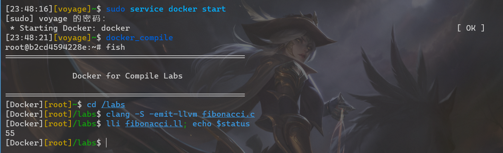

# Lab0 实验报告

PB20000137 李远航

## 实验要求

1. 使用 Docker 镜像搭建实验环境
2. 配置 GitLab, Git

## 实验任务

1. 成功搭建实验环境的截图
   
2. 对 Docker 的理解：
   - 类似于虚拟机
   - 一个应用程序
   - 独立于本地的一套编程环境
   - 可以快速创建移除环境，多种环境之间不会产生冲突，方便移植
   - 节省空间

## 实验反馈（可选）

- docker 的安装过程可以写的详细一点
