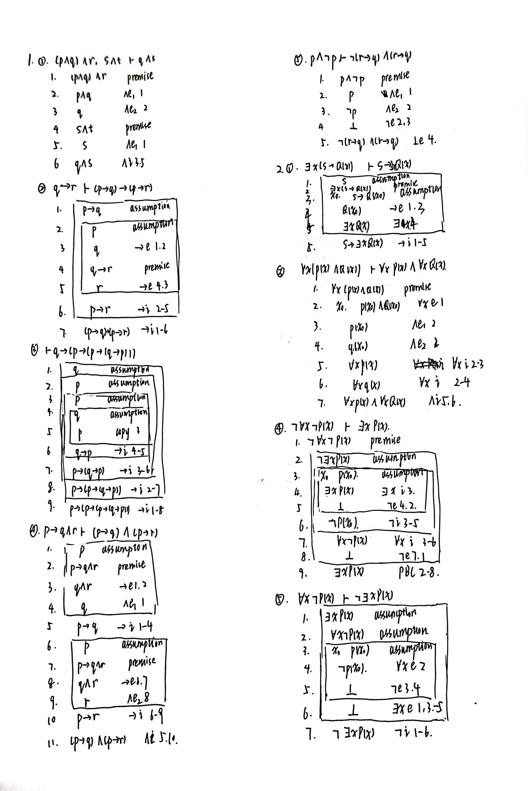
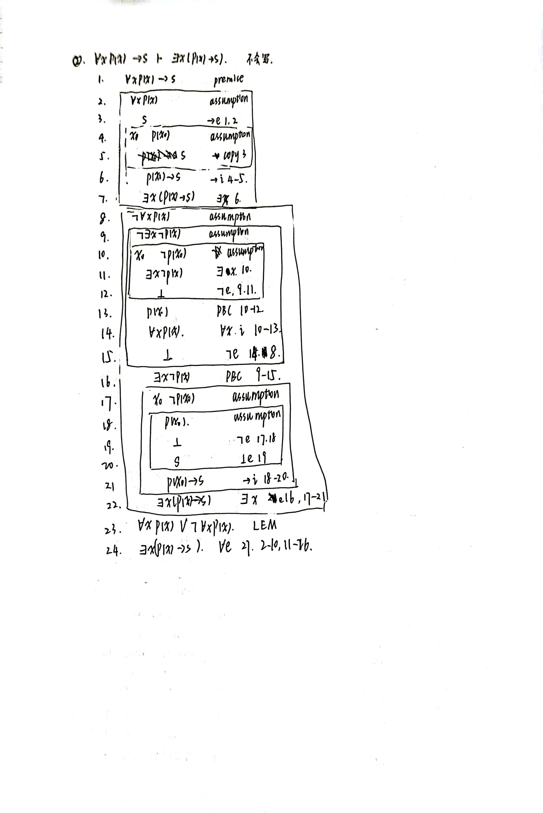

## HW2

PB20000137 李远航

### a.

- 
- 
- 
- 

### 1.

- $\forall x(P(x)\rightarrow A(m,x))$
- $\exists x (P(x)\land A(x,m))$
- $A(m,m)$
- $\neg \exists x(S(x)\land \forall y(L(y)\rightarrow B(x,y))$
- $\neg \exists y(L(y)\land \forall x(S(x)\rightarrow B(x,y))$
- $\neg \exists y (L(y)\land \exists x (S(x) \land B(x,y)))$

### 2.

(a) 对于任意的$x$，可以取 $y=x+1$，$z = x-1$，此时满足

(b) 对于任意的$x$，可以取 $y=2x$，$z=x$，此时满足

(c) 对于任意的$x$，可以取 $y = x+4$，$z=x+2$，此时满足

