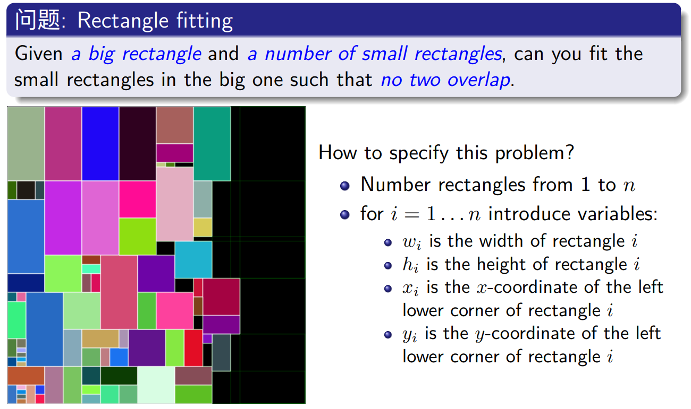
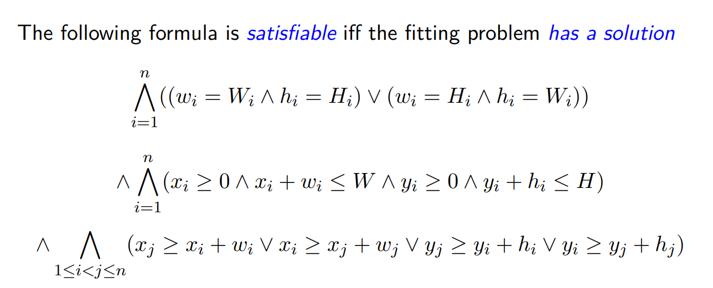

## Rectangle-fitting

<p style="text-align:right">李远航 PB20000137</p>

#### 一、实验内容

分别用 Z3 和自己设计的算法求解 rectangle fitting



#### 二、实验思路

- 使用`z3`求解（使用PPT中的思路）

  - 写出如下的约束表达式：

    

  - 将上述约束转化成代码用`z3`求解：

    ```python
    # 约束 长方形的长宽,可以颠倒
    for i in range(length):
        s.add(Or(And(W[i] == wlist[i], H[i] == hlist[i]),
              And(W[i] == hlist[i], H[i] == wlist[i]
    # 约束 长方形的范围不超过最大
    for i in range(length):
        s.add(X[i] >= 0)
        s.add(Y[i] >= 0)
        s.add(X[i] + W[i] <= maxw)
        s.add(Y[i] + H[i] <= ma
    # 约束 长方形不覆盖
    for i in range(length):
        for j in range(i+1, length):
            s.add(Or(X[j] >= X[i]+W[i], X[i] >= X[j]+W[j],
                  Y[j] >= Y[i]+H[i], Y[i] >= Y[j]+H[j]))
    ```

- 使用自己的方法求解

  - 由于Rectangle-fitting实际上是一个NP-hard问题， 所以正常方法难以求解，这里使用搜索策略，通过递归回溯的方式求解

  - 每一个小长方形的左下角一定在格点上，由于小长方形的安排顺序并不影响最终的结果，所以依次递归遍历每一个格点，一定可以找到如果存在的解

  - 为了避免不必要的遍历，在程序开始前，将所有长方形的长宽同时除以最大公因子

  - 优先安排面积最大的小长方形

  - csp约束条件：

    ```python
    def isvalid(wlist, hlist, x, y):
        l = len(x)
        for i in range(l):
            for j in range(i+1, l):
                if x[j] < x[i]+wlist[i] and x[i] < x[j]+wlist[j] and 
                y[j] < y[i]+hlist[i] and y[i] < y[j]+hlist[j]:
                    return False
        return True
    ```

  - 递归函数：

    ```python
    def solve_recursion(maxw, maxh, wlist, hlist, now_x, now_y):
        if not isvalid(wlist, hlist, now_x, now_y):
            return False, [], []
    
        now_loc = len(now_x)
        if now_loc == len(wlist):
            print(wlist, hlist)
            return True, now_x, now_y
    
        now_w, now_h = wlist[now_loc], hlist[now_loc]
        for i in range(maxw):
            for j in range(maxh):
                if i + now_w <= maxw and j + now_h <= maxh:
                    now_x.append(i)
                    now_y.append(j)
                    ret = solve_recursion(maxw, maxh, wlist, hlist, now_x, now_y)
                    if ret[0]:
                        return True, ret[1], ret[2]
                    now_x = now_x[:now_loc]
                    now_y = now_y[:now_loc]
    
        wlist[now_loc], hlist[now_loc] = hlist[now_loc], wlist[now_loc]
        now_w, now_h = wlist[now_loc], hlist[now_loc]
        for i in range(maxw):
            for j in range(maxh):
                if i + now_w <= maxw and j + now_h <= maxh:
                    now_x.append(i)
                    now_y.append(j)
                    ret = solve_recursion(maxw, maxh, wlist, hlist, now_x, now_y)
                    if ret[0]:
                        return True, ret[1], ret[2]
                    now_x = now_x[:now_loc]
                    now_y = now_y[:now_loc]
    
        return False, [], []
    ```

#### 三、实验结果

使用测试数据：

```bash
7 7
2 1
2 1
2 1
2 1
1 1
5 2
5 2
5 2
5 2
```

可以看到，两种方法均能求出答案:

```bash
X0 = 6 Y0 = 3 W0 = 1 H0 = 2
X1 = 6 Y1 = 1 W1 = 1 H1 = 2
X2 = 0 Y2 = 6 W2 = 2 H2 = 1
X3 = 0 Y3 = 0 W3 = 2 H3 = 1
X4 = 6 Y4 = 0 W4 = 1 H4 = 1
X5 = 2 Y5 = 5 W5 = 5 H5 = 2
X6 = 2 Y6 = 0 W6 = 2 H6 = 5
X7 = 0 Y7 = 1 W7 = 2 H7 = 5
X8 = 4 Y8 = 0 W8 = 2 H8 = 5
[5, 5, 5, 2, 2, 2, 2, 2, 1] [2, 2, 2, 5, 1, 1, 1, 1, 1]
((True, [0, 0, 0, 5, 0, 2, 4, 5, 6], [0, 2, 4, 0, 6, 6, 6, 5, 6]), 1)
```

性能比较：（测试数据见`input`目录）

|           | input0   | input1   | input2   | input3(无解) |
| --------- | -------- | -------- | -------- | ------------ |
| z3        | 0.01844s | 0.03959s | 1.26748s | 1.02537s     |
| recursion | 0.00008s | 0.00040s | 0.00404s | 5.77381s     |

可以看到

- 由于搜索策略的使用，递归回溯的方法相比`z3`求解能有更高的性能
- 对于`input3`无解的情形，由于递归算法需要遍历整个取值空间，性能急剧下降，远低于`z3`求解
- 在解决现实问题时，为了应对多样化的需求，应该尽量使用`z3`求解，避免极端数据

#### 四、实验收获

- 使用SMT解决问题思路清晰，且性能高效
- 使用搜索的方式解决约束满足问题在策略合理的情况下，一样能达到不错的效率
