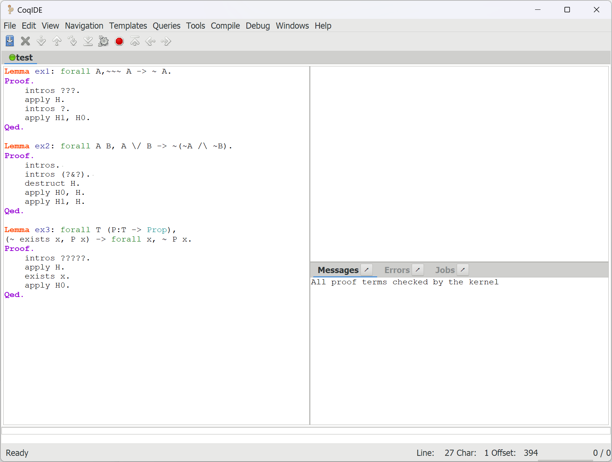

## Lab3

<p style="text-align:right">李远航 PB20000137</p>

#### 一、实验内容

​	使⽤Coq证明如下命题:

```bash
Lemma ex1: forall A, ~~~ A -> ~ A.
Lemma ex2: forall A B, A \/ B -> ~ (~ A /\ ~ B).
Lemma ex3: forall T (P:T -> Prop),(~ exists x, P x) -> forall x, ~ P x.
```

### 二、实验思路

- $$\forall A\ , \neg \neg \neg A \rightarrow \neg A$$

  先将变量全部引入，通过假设推出矛盾的方式来证明

- $$\forall A\ \forall B\ , A \or B \rightarrow \neg (\neg A\and \neg B)$$

  和前面相同，先引入变量，然后将$\neg (\neg A\and \neg B)$分解为 $\neg A$ 和 $\neg B$ 按情况分析，通过推出矛盾证明

- $$\forall T\ (P:T -> Prop),(\neg \exists x, P\ x) \rightarrow \forall x\ , \neg P\ x$$

  引入类型T，谓词P，以及后续的变量，利用存在性推出矛盾证明

### 三、实验结果

- $$\forall A\ , \neg \neg \neg A \rightarrow \neg A$$

  ```bash
  1 goal
  ______________________________________(1/1)
  forall A : Prop, ~ ~ ~ A -> ~ A
  
  1 goal
  A : Prop
  H : ~ ~ ~ A
  H0 : A
  ______________________________________(1/1)
  False
  
  1 goal
  A : Prop
  H : ~ ~ ~ A
  H0 : A
  ______________________________________(1/1)
  ~ ~ A
  
  1 goal
  A : Prop
  H : ~ ~ ~ A
  H0 : A
  H1 : ~ A
  ______________________________________(1/1)
  False
  
  No more goals.
  ```

- $$\forall A\ \forall B\ , A \or B \rightarrow \neg (\neg A\and \neg B)$$

  ```bash
  1 goal
  ______________________________________(1/1)
  forall A B : Prop, A \/ B -> ~ (~ A /\ ~ B)
  
  1 goal
  A, B : Prop
  H : A \/ B
  ______________________________________(1/1)
  ~ (~ A /\ ~ B)
  
  1 goal
  A, B : Prop
  H : A \/ B
  H0 : ~ A
  H1 : ~ B
  ______________________________________(1/1)
  False
  
  2 goals
  A, B : Prop
  H : A
  H0 : ~ A
  H1 : ~ B
  ______________________________________(1/2)
  False
  ______________________________________(2/2)
  False
  
  1 goal
  A, B : Prop
  H : B
  H0 : ~ A
  H1 : ~ B
  ______________________________________(1/1)
  False
  
  No more goals.
  ```

- $$\forall T\ (P:T -> Prop),(\neg \exists x, P\ x) \rightarrow \forall x\ , \neg P\ x$$

  ```bash
  1 goal
  ______________________________________(1/1)
  forall (T : Type) (P : T -> Prop),
  ~ (exists x : T, P x) -> forall x : T, ~ P x
  
  1 goal
  T : Type
  P : T -> Prop
  H : ~ (exists x : T, P x)
  x : T
  H0 : P x
  ______________________________________(1/1)
  False
  
  1 goal
  T : Type
  P : T -> Prop
  H : ~ (exists x : T, P x)
  x : T
  H0 : P x
  ______________________________________(1/1)
  exists x0 : T, P x0
  
  1 goal
  T : Type
  P : T -> Prop
  H : ~ (exists x : T, P x)
  x : T
  H0 : P x
  ______________________________________(1/1)
  P x
  
  No more goals.
  ```



### 四、实验收获

- 初步学习了Coq
- 对逻辑式的证明有更深的理解
