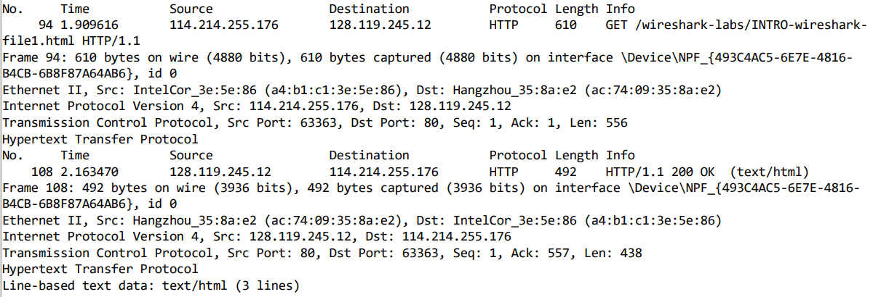

### 计算机网络实验报告-lab1

李远航

PB20000137

- 1.List 3 different protocols that appear in the protocol column in the unfiltered packet-listing window in step 7 above.

  TCP,HTTP,UDP

- 2.How long did it take from when the HTTP GET message was sent until the HTTP OK reply was received?

  0.253854s

- 3.What is the Internet address of the gaia.cs.umass.edu ? What is the Internet address of your computer?

  **my computer**:114.214.255.176

  **destination**:128.119.245.12

- 4.Print the two HTTP messages (GET and OK) referred to in question 2 above.

  
