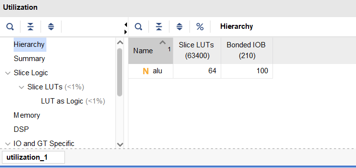
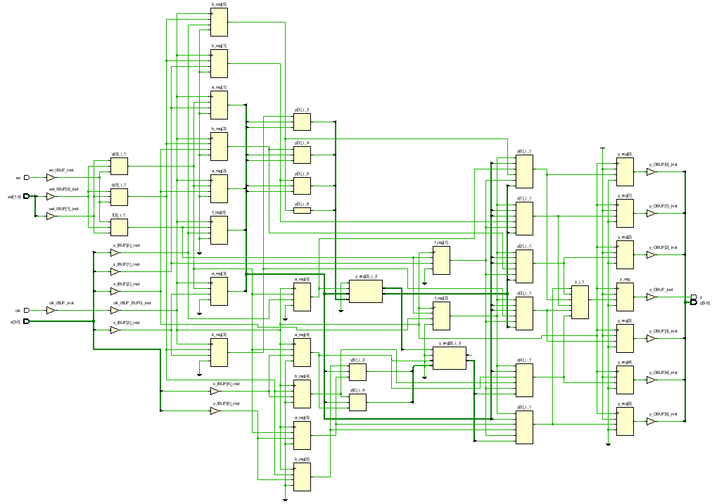
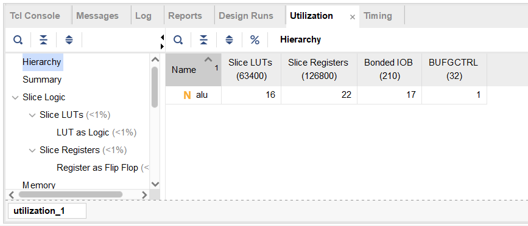
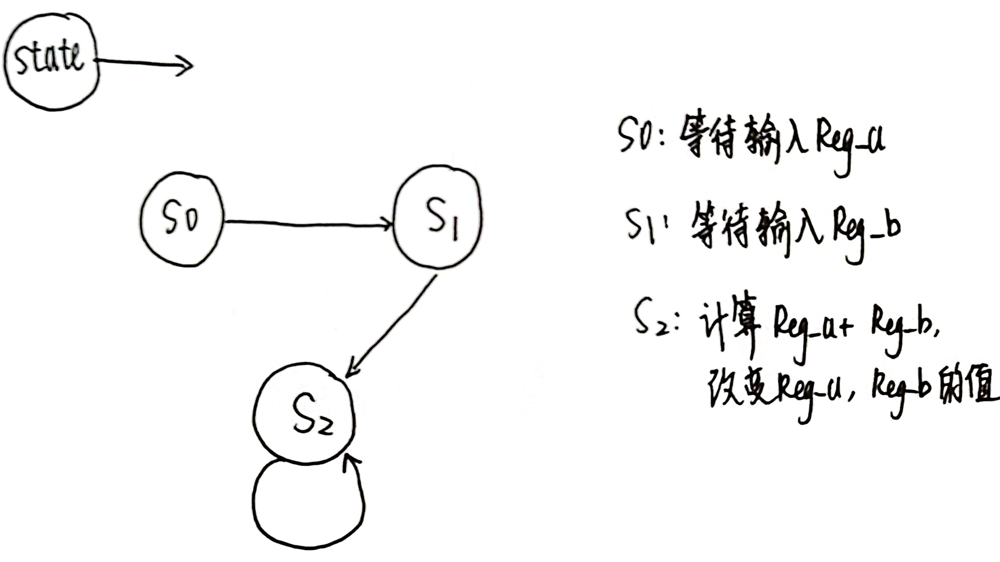
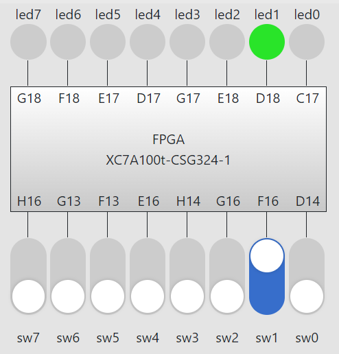
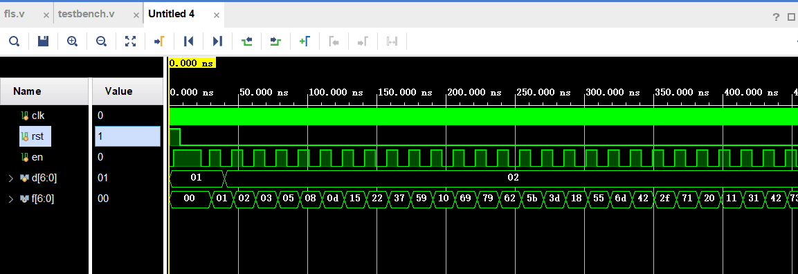

## Lab1 运算器及其应用

<p style="text-align:right"> 李远航</p>
<p style="text-align:right"> PB20000137</p>

#### 1. 实验内容

- 完成 ALU 模块的逻辑设计和仿真
- 查看 32 位 ALU 的 RTL 和综合电路图，以及综合电路资源和时间性能报告
- 完成 6 位 ALU 的下载测试，并查看 RTL 电路图，以及实现电路资源和时间性能报告
- 完成 FLS 的逻辑设计、仿真和下载测试

#### 2. 实验过程

##### (1) 32 位 ALU 的设计

- `verilog`代码

  ```verilog
  module alu#(parameter WIDTH=32)
  (
  input  [WIDTH-1:0] a, b,
  input  [2:0] f,
  output  reg [WIDTH-1:0] y,
  output  reg z
  );
      always@(*) begin
          case(f)
              3'b000: y=a+b;
              3'b001: y=a-b;
              3'b010: y=a&b;
              3'b011: y=a|b;
              3'b100: y=a^b;
              default: y=1'b0;
          endcase
          if(y==1'b0)
              z=1;
      end
  endmodule
  ```

&nbsp;
&nbsp;

- RTL 电路

  

- 综合电路

  

- 综合电路资源使用情况
  
- ALU 模块时间性能报告
  > 无 clk 因此无综合电路性能

##### （2）6 位操作数 ALU

- 设计思路

  使用译码器，复用输入端口，输入信号根据 sel 信号的不同赋值给不同的寄存器

- `verilog`代码

  ```verilog
  module alu(
      input clk,
      input  en,
      input  [1:0] sel,
      input  [5:0] x,
      output  reg [5:0] y,
      output  reg z
  );
      reg ena,enb,ef;
      reg [5:0] a;
      reg [5:0] b;
      reg [2:0] f;
      always@(*)
      begin
          if(en==0) begin
              ena=0;
              enb=0;
              ef=0;
          end
          else if(sel==2'b00) begin
              ena=1;
              enb=0;
              ef=0;
          end
          else if(sel==2'b01) begin
              ena=0;
              enb=1;
              ef=0;
          end
          else if(sel==2'b10) begin
              ena=0;
              enb=0;
              ef=1;
          end
          else begin
              ena=0;
              enb=0;
              ef=0;
          end
      end

      always@(posedge clk) begin
          if(ef==1)
              f=x[2:0];
          else if (ena==1)
              a=x;
          else if (enb==1)
              b=x;
      end

      reg [5:0] y_ans;
      reg z_ans;
      always@(*)
      begin
          case(f)
              3'b000: y_ans=a+b;
              3'b001: y_ans=a-b;
              3'b010: y_ans=a&b;
              3'b011: y_ans=a|b;
              3'b100: y_ans=a^b;
              default: y_ans=1'b0;
          endcase
          if(y_ans==1'b0)
              z_ans=1;
          else
              z_ans=0;
      end

      always@(posedge clk) begin
          y<=y_ans;
          z<=z_ans;
      end
  endmodule
  ```

- 管脚约束文件
  

- 烧写 bit 流，计算 $3+5$ 的结果
  

- RTL 电路
  
- 综合电路
  
- 综合电路资源使用情况
  
- ALU 模块时间性能报告
  

##### （3）Fibonacci 数列的计算

- 设计思路：

  使用 3 个状态：
  

- `verilog`代码

  > alu 使用实验过程(1)中 alu 模块

  ```verilog
  module  fls (
    input  clk, rst, en,
    input  [6:0]  d,
    output [6:0]  f
  );

      reg [1:0] cs,ns;
      reg state1;
      reg state2;
      reg [6:0] reg_a, reg_b;
      wire button_edge;

      //生成脉冲信号
      reg button_r1,button_r2;
      always@(posedge clk)
          button_r1 <= en;
      always@(posedge clk)
          button_r2 <= button_r1;
      assign button_edge = button_r1 & (~button_r2);

      parameter s0 = 2'b00;
      parameter s1 = 2'b01;
      parameter s2 = 2'b10;

      //初始化
      initial begin
          state1 = 0;
          state2 = 0;
          cs <= s0;
          reg_a <= 0;
          reg_b = 0;
      end
      //状态机
      always@ (posedge clk)
          if (rst)
              cs <= s0;
          else
              cs <= ns;

      always @(*) begin
          case (cs)
              s0:
                  if(state1 == 1)
                      ns = s1;
                  else
                      ns = s0;
              s1: if(state2 == 1)
                      ns = s2;
                  else
                      ns = s1;
              s2: ns = s2;
              default: ns = s0;
          endcase
      end

      wire [6:0] sum;
      alu #(7) alu(reg_a,reg_b,0,sum);

      always @(posedge clk)
      begin
          if(rst) begin
              state1 <= 0;
              state2 <= 0;
              reg_a <= 0;
              reg_b <= 0;
          end
          else if(button_edge) begin
              case(cs)
                  s0: begin
                          reg_b <= d ;
                          reg_a <= reg_b;
                          state1 = ~state1;
                      end
                  s1: begin
                          reg_b <= d ;
                          reg_a <= reg_b;
                          state2 = ~state2;
                      end
                  s2: begin
                          reg_b <= sum;
                          reg_a <= reg_b;
                      end
              endcase
          end
      end

      assign f = reg_b;

  endmodule
  ```

- 管脚约束文件
  

- 运行结果，初始值设为 1 ，2

  
  
  

- 仿真图像
  

#### 3. 实验收获

- 复习了`verilog`的语法
- 复习了有限状态机的书写
- 学习了 ALU 的编写
