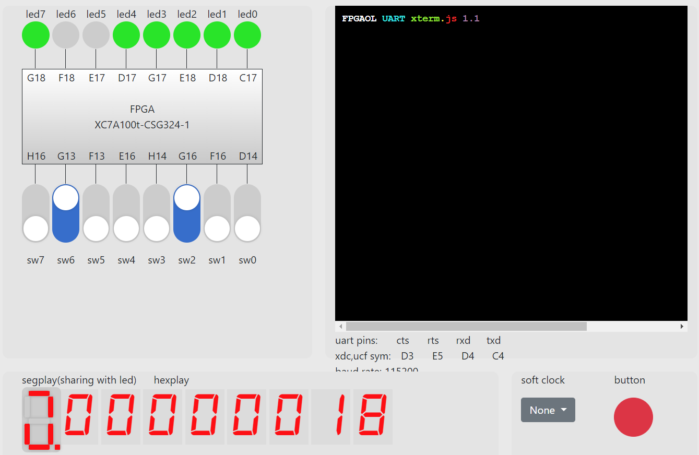

## Lab5 流水线 CPU 设计

<p style="text-align:right"> 李远航</p>
<p style="text-align:right"> PB20000137</p>

#### 1. 实验目标

- 理解流水线 CPU 的结构和工作原理
- 掌握流水线 CPU 的设计和调试方法，特别是流水线中数据相关和控制相关的处理
- 熟练掌握数据通路和控制器的设计和描述方法

#### 2. 实验环境

- PC 一台
- Vivado 2020.2
- fpgaol.ustc.edu.cn

#### 3. 逻辑结构


#### 4. 数据通路


在课本数据的通路基础上，传递 pc+4 给寄存器写回选择器

#### 5. 具体实现

##### a) 无冒险流水线 cpu

在单周期流水线的基础下，加入流水线段寄存器(处理冒险会对段寄存器进行一定的修改，具体见最后源码)

##### b) 数据冒险

1. ForWarding

   ```verilog
   module Forwarding(
       input [31:0] ins_EX,
       input [31:0] ins_MEM,
       input [31:0] ins_WB,
       input RegWrite_MEM, RegWrite_WB,
       output reg [1:0] alu_rs1_mux_signal,
       output reg [1:0] alu_rs2_mux_signal
   );
       always@(*) begin
           if(RegWrite_MEM && ins_MEM[11:7]==ins_EX[19:15])
               alu_rs1_mux_signal = 2'b01;
           else if(RegWrite_WB && ins_WB[11:7]==ins_EX[19:15])
               alu_rs1_mux_signal = 2'b10;
           else
               alu_rs1_mux_signal = 2'b00;

           if(RegWrite_MEM && ins_MEM[11:7]==ins_EX[24:20])
               alu_rs2_mux_signal = 2'b01;
           else if(RegWrite_WB && ins_WB[11:7]==ins_EX[24:20])
               alu_rs2_mux_signal = 2'b10;
           else
               alu_rs2_mux_signal = 2'b00;
       end
   endmodule
   ```

   在 alu 的操作数前加入选择器，根据是否发生前递来选择 alu 的操作数，控制信号如上所示

2. stall

   ```verilog
   module stall(
       input MemRead_EX, Branch_ID, RegWrite_EX, RegWrite_MEM, RegWrite_WB,
       input [31:0] ins_EX,
       input [31:0] ins_ID,
       input [31:0] ins_MEM,
       input [31:0] ins_WB,
       output reg pc_write, IF_ID_write, control_mux, jump
   );
       always@(*) begin
           if(MemRead_EX && (ins_EX[11:7]==ins_ID[19:15]||ins_EX[11:7]==ins_ID[24:20])) begin
               pc_write = 0;
               IF_ID_write = 0;
               control_mux = 1;
               jump = 0;
           end
           else begin
               pc_write = 1;
               IF_ID_write = 1;
               control_mux = 0;
               jump = 0;
           end
       end
   endmodule
   ```

   判断是否需要 stall，如果需要 stall，则 IF_ID 寄存器下一个时钟周期内不向后传递数据，ID_EX 寄存器向后传递的数据为 0

3. 控制冒险

   ```verilog
   //判断阻塞
   else if(Branch_ID && RegWrite_EX && (ins_EX[11:7]==ins_ID[19:15]||ins_EX[11:7]==ins_ID[24:20])) begin
       pc_write = 0;
       IF_ID_write = 0;
       control_mux = 1;
       jump = 0;
   end
   else if(Branch_ID && RegWrite_MEM && (ins_MEM[11:7]==ins_ID[19:15]||ins_MEM[11:7]==ins_ID[24:20])) begin
       pc_write = 0;
       IF_ID_write = 0;
       control_mux = 1;
       jump = 0;
   end
   //判断是否需要跳转，同时将jump信号传递给IF_ID段寄存器
   assign jump = (jump_branch && Read_data_1_ID==Read_data_2_ID)||jal_ID;
   mux2to1 pc_mux(
       .a(pc_4_IF),
       .b(pc_offset_ID),
       .sel(jump),
       .out(next_pc)
   );
   ```

分支指令需要取的寄存器即将被写入，则直接 stall 到该寄存器可以取用的 WB 阶段，然后直接在 ID 阶段判断跳转，如果需要跳转，则将此时写入 IF 的指令 flush 掉

#### 6. 运行截图

1. harzards_test.s



2. fib_test.s


#### 7. 实验收获

- 理解了流水线 CPU 的结构和工作原理
- 掌握了流水线 CPU 的设计和调试方法
- 掌握了数据通路和控制器的设计和描述方法
- 对流水线的冒险处理有的更深的认识

#### 8. 源码

```verilog

module top(
    input run, step, valid, rst, clk,
    input [4:0] in,
    output [1:0] check,
    output [4:0] out0,

    // output [31:0] pcin, pc, pcd, pce,
    // output [31:0] ir, imm, mdr,
    // output [31:0] a, b, y, bm, yw,
    // output [4:0] rd, rdm, rdw,
    // output [31:0] ctrl, ctrlm, ctrlw,

    output ready,
    output [2:0] an,
    output [3:0] seg
);

    wire clk_cpu;

    //IO_BUS
    wire [7:0] io_addr;
    wire [31:0] io_dout;
    wire io_we;
    wire [31:0] io_din;

    //Debug_BUS
    wire [7:0] m_rf_addr;
    wire [31:0] rf_data;
    wire [31:0] m_data;

    wire [31:0] pcin, pc, pcd, pce;
    wire [31:0] ir, imm, mdr;
    wire [31:0] a, b, y, bm, yw;
    wire [4:0] rd, rdm, rdw;
    wire [31:0] ctrl, ctrlm, ctrlw;

    pdu pdu(
        .clk(clk),
        .rst(rst),
        .run(run),
        .step(step),
        .clk_cpu(clk_cpu),
        .valid(valid),
        .in(in),
        .check(check),
        .out0(out0),
        .an(an),
        .seg(seg),
        .ready(ready),
        .io_addr(io_addr),
        .io_dout(io_dout),
        .io_we(io_we),
        .io_din(io_din),
        .m_rf_addr(m_rf_addr),
        .rf_data(rf_data),
        .m_data(m_data),
        .pcin(pcin),
        .pc(pc),
        .pcd(pcd),
        .pce(pce),
        .ir(ir),
        .imm(imm),
        .mdr(mdr),
        .a(a),
        .b(b),
        .y(y),
        .bm(bm),
        .yw(yw),
        .rd(rd),
        .rdm(rdm),
        .rdw(rdw),
        .ctrl(ctrl),
        .ctrlm(ctrlm),
        .ctrlw(ctrlw)
    );

    cpu_pipline cpu_pipline(
        .clk(clk_cpu),
        .rst(rst),
        .io_addr(io_addr),
        .io_dout(io_dout),
        .io_we(io_we),
        .io_din(io_din),
        .m_rf_addr(m_rf_addr),
        .rf_data(rf_data),
        .m_data(m_data),
        .pcin(pcin),
        .pc(pc),
        .pcd(pcd),
        .pce(pce),
        .ir(ir),
        .imm(imm),
        .mdr(mdr),
        .a(a),
        .b(b),
        .y(y),
        .bm(bm),
        .yw(yw),
        .rd(rd),
        .rdm(rdm),
        .rdw(rdw),
        .ctrl(ctrl),
        .ctrlm(ctrlm),
        .ctrlw(ctrlw)
    );

endmodule
module cpu_pipline(
    input clk,rst,
    output [7:0] io_addr,
    output [31:0] io_dout,
    output io_we,
    input [31:0] io_din,

    input [7:0] m_rf_addr,
    output [31:0] rf_data,
    output [31:0] m_data,

    output [31:0] pcin, pc, pcd, pce,
    output [31:0] ir, imm, mdr,
    output [31:0] a, b, y, bm, yw,
    output [4:0]  rd, rdm, rdw,
    output [31:0] ctrl, ctrlm, ctrlw
);
    wire [31:0] pc_IF, pc_ID, pc_EX, pc_MEM, pc_WB;
    wire [31:0] pc_4_IF, pc_4_ID, pc_4_EX, pc_4_MEM, pc_4_WB;
    wire [31:0] pc_offset_IF, pc_offset_ID, pc_offset_EX, pc_offset_MEM, pc_offset_WB;
    wire [31:0] ins_IF, ins_ID, ins_EX, ins_MEM, ins_WB;
    wire [31:0] alu_result_IF, alu_result_ID, alu_result_EX, alu_result_MEM, alu_result_WB;
    wire alu_zero_IF, alu_zero_ID, alu_zero_EX, alu_zero_MEM, alu_zero_WB;
    wire [31:0] Read_data_1_IF, Read_data_1_ID, Read_data_1_EX, Read_data_1_MEM, Read_data_1_WB;
    wire [31:0] Read_data_2_IF, Read_data_2_ID, Read_data_2_EX, Read_data_2_MEM, Read_data_2_WB;
    wire [31:0] memory_read_data, memory_read_data_IF, memory_read_data_ID, memory_read_data_EX, memory_read_data_MEM, memory_read_data_WB;
    wire [31:0] Write_data_IF, Write_data_ID, Write_data_EX, Write_data_MEM, Write_data_WB;
    wire [31:0] immediate_num_IF, immediate_num_ID, immediate_num_EX, immediate_num_MEM, immediate_num_WB;
    wire [31:0] alu_op1, alu_op2;
    wire [2:0] alu_control;
    wire [31:0] next_pc;

    wire Branch_ID, MemRead_ID, MemWrite_ID, RegWrite_ID, ALUsrc_ID, jal_ID;
    wire [1:0] ALUop_ID, MemtoReg_ID;
    wire Branch_EX, MemRead_EX, MemWrite_EX, RegWrite_EX, ALUsrc_EX, jal_EX;
    wire [1:0] ALUop_EX, MemtoReg_EX;
    wire Branch_MEM, MemRead_MEM, MemWrite_MEM, RegWrite_MEM, ALUsrc_MEM, jal_MEM;
    wire [1:0] ALUop_MEM, MemtoReg_MEM;
    wire Branch_WB, MemRead_WB, MemWrite_WB, RegWrite_WB, ALUsrc_WB, jal_WB;
    wire [1:0] ALUop_WB, MemtoReg_WB;
    wire [1:0] alu_rs1_mux_signal, alu_rs2_mux_signal;
    wire [31:0] alu_rs1_fw, alu_rs2_fw;

    wire pc_write, IF_ID_write, control_mux;
    wire jump_branch, jump;

    assign pc = pc_IF;
    assign pcd = pc_ID;
    assign ir = ins_ID;
    assign pcin = next_pc;
    assign pce = pc_EX;
    assign a = alu_rs1_fw;
    assign b = alu_rs2_fw;
    assign imm = immediate_num_EX;
    assign rd = ins_EX[11:7];
    assign ctrl = {~IF_ID_write,~control_mux,jump,3'b0,alu_rs1_mux_signal,2'b0,alu_rs2_mux_signal,1'b0,RegWrite_ID,MemtoReg_ID,2'b0,MemRead_ID,MemWrite_ID,2'b0,jal_ID,Branch_ID,2'b0,alu_rs1_mux_signal,alu_rs2_mux_signal,ALUop_ID};
    assign y = alu_result_MEM;
    assign bm = Read_data_2_MEM;
    assign rdm = ins_MEM[11:7];
    assign ctrlm = {~IF_ID_write,~control_mux,jump,3'b0,alu_rs1_mux_signal,2'b0,alu_rs2_mux_signal,1'b0,RegWrite_MEM,MemtoReg_MEM,2'b0,MemRead_MEM,MemWrite_MEM,2'b0,jal_MEM,Branch_MEM,2'b0,alu_rs1_mux_signal,alu_rs2_mux_signal,ALUop_MEM};
    assign yw = alu_result_WB;
    assign mdr = memory_read_data_WB;
    assign rdw = ins_WB[11:7];
    assign ctrlw = {~IF_ID_write,~control_mux,jump,3'b0,alu_rs1_mux_signal,2'b0,alu_rs2_mux_signal,1'b0,RegWrite_WB,MemtoReg_WB,2'b0,MemRead_WB,MemWrite_WB,2'b0,jal_WB,Branch_WB,2'b0,alu_rs1_mux_signal,alu_rs2_mux_signal,ALUop_WB};


    // assign temp1 = alu_rs1_mux_signal;
    // assign temp2 = alu_rs2_mux_signal;
    // assign temp0 = {27'b0,ins_EX[11:7]};
    // assign temp = {27'b0,ins_ID[19:15]};
    // assign temp1 = IF_ID_write;
    // assign temp2 = pc_write;
    // assign temp3 = control_mux;

    pc pc_reg(
        .in(next_pc),
        .rst(rst),
        .clk(clk),
        .en(pc_write),
        .out(pc_IF)
    );


    add pc_add(
        .a(pc_IF),
        .b(32'd4),
        .out(pc_4_IF)
    );

    dist_mem_gen_3 Instruction_memory (
        .clk(clk),
        .we(1'b0),
        .d(0),
        .a(pc_IF[9:2]),
        .spo(ins_IF)
    );

    dist_mem_gen_1 Data_memory (
        .a(alu_result_MEM[9:2]),
        .d(Read_data_2_MEM),
        .dpra(m_rf_addr),
        .clk(clk),
        .we(MemWrite&&(~alu_result_MEM[10])),
        .spo(memory_read_data),
        .dpo(m_data)
    );

    register reg_file(
        .clk(clk),
        .rst(rst),
        .w_en(RegWrite_WB||jal_WB),
        .addr1(ins_ID[19:15]),
        .addr2(ins_ID[24:20]),
        .addr3(ins_WB[11:7]),
        .w_data3(Write_data_WB),
        .rd_data1(Read_data_1_ID),
        .rd_data2(Read_data_2_ID),
        .debug_addr(m_rf_addr),
        .debug_data(rf_data)
    );

    Immgen Immgen(
        .instruction(ins_ID),
        .immediate(immediate_num_ID)
    );

    control control(
        .ins(ins_ID[6:0]),
        .Branch(Branch_ID),
        .MemRead(MemRead_ID),
        .MemtoReg(MemtoReg_ID),
        .MemWrite(MemWrite_ID),
        .ALUsrc(ALUsrc_ID),
        .RegWrite(RegWrite_ID),
        .ALUop(ALUop_ID),
        .jal(jal_ID)
    );

    IF_ID IF_ID(
        .clk(clk),
        .rst(rst),
        .en(IF_ID_write),
        .jump(jump),
        .ins(ins_IF),
        .pc(pc_IF),
        .pc_4(pc_4_IF),
        .ins_o(ins_ID),
        .pc_o(pc_ID),
        .pc_4_o(pc_4_ID)
    );

    ID_EX ID_EX(
        .clk(clk),
        .rst(rst),
        .en(control_mux),
        .ins(ins_ID),
        .immediate(immediate_num_ID),
        .pc(pc_ID),
        .pc_4(pc_4_ID),
        .rd1(Read_data_1_ID),
        .rd2(Read_data_2_ID),
        .ins_o(ins_EX),
        .immediate_o(immediate_num_EX),
        .pc_o(pc_EX),
        .pc_4_o(pc_4_EX),
        .rd1_o(Read_data_1_EX),
        .rd2_o(Read_data_2_EX),
        .Branch(Branch_ID),
        .MemRead(MemRead_ID),
        .MemtoReg(MemtoReg_ID),
        .MemWrite(MemWrite_ID),
        .ALUsrc(ALUsrc_ID),
        .RegWrite(RegWrite_ID),
        .ALUop(ALUop_ID),
        .jal(jal_ID),
        .Branch_o(Branch_EX),
        .MemRead_o(MemRead_EX),
        .MemtoReg_o(MemtoReg_EX),
        .MemWrite_o(MemWrite_EX),
        .ALUsrc_o(ALUsrc_EX),
        .RegWrite_o(RegWrite_EX),
        .ALUop_o(ALUop_EX),
        .jal_o(jal_EX)
    );

    EX_MEM EX_MEM(
        .clk(clk),
        .rst(rst),
        .pc_4(pc_4_EX),
        .pc_offset(pc_offset_EX),
        .alu_result(alu_result_EX),
        .alu_zero(alu_zero_EX),
        .rd2(alu_rs2_fw),
        .ins(ins_EX),
        .pc_4_o(pc_4_MEM),
        .pc_offset_o(pc_offset_MEM),
        .alu_result_o(alu_result_MEM),
        .alu_zero_o(alu_zero_MEM),
        .rd2_o(Read_data_2_MEM),
        .ins_o(ins_MEM),
        .Branch(Branch_EX),
        .MemRead(MemRead_EX),
        .MemtoReg(MemtoReg_EX),
        .MemWrite(MemWrite_EX),
        .RegWrite(RegWrite_EX),
        .jal(jal_EX),
        .Branch_o(Branch_MEM),
        .MemRead_o(MemRead_MEM),
        .MemtoReg_o(MemtoReg_MEM),
        .MemWrite_o(MemWrite_MEM),
        .RegWrite_o(RegWrite_MEM),
        .jal_o(jal_MEM)
    );

    MEM_WB MEM_WB(
        .clk(clk),
        .rst(rst),
        .alu_result(alu_result_MEM),
        .ins(ins_MEM),
        .MemReadData(memory_read_data_MEM),
        .pc_4(pc_4_MEM),
        .alu_result_o(alu_result_WB),
        .ins_o(ins_WB),
        .MemReadData_o(memory_read_data_WB),
        .pc_4_o(pc_4_WB),
        .MemtoReg(MemtoReg_MEM),
        .RegWrite(RegWrite_MEM),
        .MemtoReg_o(MemtoReg_WB),
        .RegWrite_o(RegWrite_WB)
    );

    assign alu_op1 = alu_rs1_fw;
    mux3to1 alu_rs1_mux(
        .a(Read_data_1_EX),
        .b(alu_result_MEM),
        .c(Write_data_WB),
        .sel(alu_rs1_mux_signal),
        .out(alu_rs1_fw)
    );

    mux3to1 alu_rs2_mux(
        .a(Read_data_2_EX),
        .b(alu_result_MEM),
        .c(Write_data_WB),
        .sel(alu_rs2_mux_signal),
        .out(alu_rs2_fw)
    );

    Forwarding Forwarding(
        .ins_EX(ins_EX),
        .ins_MEM(ins_MEM),
        .ins_WB(ins_WB),
        .RegWrite_MEM(RegWrite_MEM),
        .RegWrite_WB(RegWrite_WB),
        .alu_rs1_mux_signal(alu_rs1_mux_signal),
        .alu_rs2_mux_signal(alu_rs2_mux_signal)
    );

    stall stall(
        .MemRead_EX(MemRead_EX),
        .Branch_ID(Branch_ID),
        .RegWrite_EX(RegWrite_EX),
        .RegWrite_MEM(RegWrite_MEM),
        .RegWrite_WB(RegWrite_WB),
        .ins_EX(ins_EX),
        .ins_ID(ins_ID),
        .ins_MEM(ins_MEM),
        .ins_WB(ins_WB),
        .pc_write(pc_write),
        .IF_ID_write(IF_ID_write),
        .control_mux(control_mux),
        .jump(jump_branch)
    );

    mux2to1 alu_mux(
        .a(alu_rs2_fw),
        .b(immediate_num_EX),
        .sel(ALUsrc_EX),
        .out(alu_op2)
    );

    alucontrol alucontrol(
        .ALUOp(ALUop_EX),
        .ALUout(alu_control),
        .funct7(ins_EX[31:25])
    );

    alu alu(
        .a(alu_op1),
        .b(alu_op2),
        .f(alu_control),
        .z_r(alu_zero_EX),
        .y_r(alu_result_EX)
    );

    mux2to1 sw_lw_mux(
        .a(memory_read_data),
        .b(io_din[31:0]),
        .sel(alu_result_MEM[10]),
        .out(memory_read_data_MEM)
    );

    mux3to1 reg_mux(
        .a(alu_result_WB),
        .b(memory_read_data_WB),
        .c(pc_4_WB),
        .sel(MemtoReg_WB),
        .out(Write_data_WB)
    );

    wire [31:0] shiftleft_already;
    shiftleft shiftleft(
        .in(immediate_num_ID),
        .out(shiftleft_already)
    );

    add pc_add_offset(
        .a(pc_ID),
        .b(shiftleft_already),
        .out(pc_offset_ID)
    );

    // assign jump = (Branch_ID&&Read_data_1_ID==Read_data_2_ID)||jal_ID;
    // assign IF_ID_write_jump = (jump == 1) ? 0 : 1;
    // assign temp = jump;
    // assign jump_r = jump;
    assign jump = (jump_branch && Read_data_1_ID==Read_data_2_ID)||jal_ID;
    // assign jump_r = jump;
    mux2to1 pc_mux(
        .a(pc_4_IF),
        .b(pc_offset_ID),
        .sel(jump),
        .out(next_pc)
    );

    assign io_addr = alu_result_MEM[7:0];
    assign io_dout = Read_data_2_MEM;
    assign io_we = MemWrite_MEM&&(alu_result_MEM[10]);
endmoduled
module  pdu(
  input clk,
  input rst,

  //选择CPU工作方式;
  input run,
  input step,
  output clk_cpu,

  //输入switch的端口
  input valid,
  input [4:0] in,

  //输出led和seg的端口
  output [1:0] check,  //led6-5:查看类型
  output [4:0] out0,   //led4-0
  output [2:0] an,     //8个数码管
  output [3:0] seg,
  output ready,        //led7

  //IO_BUS
  input [7:0] io_addr,
  input [31:0] io_dout,
  input io_we,
  output [31:0] io_din,

  //Debug_BUS
  output reg[7:0] m_rf_addr,
  input [31:0] rf_data,
  input [31:0] m_data,

  //增加流水线寄存器调试接口
  input [31:0] pcin, pc, pcd, pce,
  input [31:0] ir, imm, mdr,
  input [31:0] a, b, y, bm, yw,
  input [4:0]  rd, rdm, rdw,
  input [31:0] ctrl, ctrlm, ctrlw
);

reg [4:0] in_r, in_2r;    //同步外部输入用，为信号in增加一级寄存器
reg run_r, step_r, step_2r, valid_r, valid_2r;
wire step_p, valid_pn;    //取边沿信号
wire pre_pn,next_pn;      //增加取边沿信号

reg clk_cpu_r;      //寄存器输出CPU时钟
reg [4:0] out0_r;   //输出外设端口
reg [31:0] out1_r;
reg ready_r;
reg [19:0] cnt;     //刷新计数器，刷新频率约为95Hz
reg [1:0] check_r;  //查看信息类型, 00-运行结果，01-寄存器堆，10-存储器，11-plr

reg [7:0] io_din_a; //_a表示为满足组合always描述要求定义的，下同
reg [4:0] out0_a;
reg [31:0] out1_a;
reg [3:0] seg_a;

//增加pre,next取边沿计数器
reg [4:0] cnt_m_rf;     //寄存器堆和存储器地址计数器
reg [1:0] cnt_ah_plr;   //流水线寄存器高两位地址计数器
reg [2:0] cnt_al_plr;   //流水线寄存器低三位地址计数器

//增加流水线寄存器地址和数据选择输入
wire [4:0] addr_plr ;
reg [31:0] plr_data;

assign clk_cpu = clk_cpu_r;
assign io_din = io_din_a;
assign check = check_r;
assign out0 = out0_a;
assign ready = ready_r;
assign seg = seg_a;
assign an = cnt[19:17];
assign step_p = step_r & ~step_2r;     //取上升沿
assign valid_pn = valid_r ^ valid_2r;  //取上升沿或下降沿
assign pre_pn =in_r[1] ^in_2r[1];      //增加pre取上升或下降沿信号
assign next_pn =in_r[0] ^in_2r[0];     //增加next取上升或下降沿信号

//同步输入信号
always @(posedge clk) begin
  run_r <= run;
  step_r <= step;
  step_2r <= step_r;
  valid_r <= valid;
  valid_2r <= valid_r;
  in_r <= in;
  in_2r <= in_r;        //为信号in增加一级寄存器
end

//CPU工作方式
always @(posedge clk, posedge rst) begin
  if(rst)
    clk_cpu_r <= 0;
  else if (run_r)
    clk_cpu_r <= ~clk_cpu_r;
  else
    clk_cpu_r <= step_p;
end

//读外设端口
always @* begin
  case (io_addr)
    8'h0c: io_din_a = {{27{1'b0}}, in_r};
    8'h10: io_din_a = {{31{1'b0}}, valid_r};
    default: io_din_a = 32'h0000_0000;
  endcase
end

//写外设端口
always @(posedge clk, posedge rst) begin
if (rst) begin
  out0_r <= 5'h1f;
  out1_r <= 32'h1234_5678;
  ready_r <= 1'b1;
end
else if (io_we)
  case (io_addr)
    8'h00: out0_r <= io_dout[4:0];
    8'h04: ready_r <= io_dout[0];
    8'h08: out1_r <= io_dout;
    default: ;
  endcase
end

//增加寄存器堆和存储器地址计数：依靠pre,next边沿计数使能
always @(posedge clk, posedge rst) begin
  if (rst) cnt_m_rf <= 5'b0_0000;
  else if (step_p)
	cnt_m_rf <= 5'b0_0000;
  else if (next_pn)
	cnt_m_rf <= cnt_m_rf + 5'b0_0001;
  else if (pre_pn)
	cnt_m_rf <= cnt_m_rf - 5'b0_0001;
end

//增加流水寄存器地址计数，流水线寄存器高两位地址依靠pre边沿计数，低三位地址依靠next边沿计数
always @(posedge clk, posedge rst) begin
  if (rst) cnt_ah_plr <= 2'b00;
  else if (step_p)
    cnt_ah_plr <= 2'b00;
  else if (pre_pn)
	cnt_ah_plr <= cnt_ah_plr + 2'b01;
end

always @(posedge clk, posedge rst) begin
  if (rst) cnt_al_plr <= 3'b000;
  else if (step_p)
	cnt_al_plr <= 3'b000;
  else if (next_pn)
	if (cnt_ah_plr==2'b01)
		if (cnt_al_plr == 3'b101)
			cnt_al_plr <= 3'b000;
		else cnt_al_plr <= cnt_al_plr + 3'b001;
	else begin
		cnt_al_plr [2] <= 1'b0;
		cnt_al_plr [1:0] <= cnt_al_plr[1:0] + 2'b01;
	end
end

assign  addr_plr = {cnt_ah_plr,cnt_al_plr};  //增加流水线寄存器地址

//寄存器堆和存储器地址输出选择
//下面的always块也可以用assign m_rf_addr = {in_r[4:2],cnt_m_rf};代替因为寄存器堆只需要低5位就可以了，不关心高3位
always @(*) begin
  case (check_r[1])
    1'b0:
	  m_rf_addr = {3'b000,cnt_m_rf};
    1'b1:
	  m_rf_addr = {in_r[4:2],cnt_m_rf};
  endcase
end

//流水线寄存器数据选择输入
always @(*)begin
  case (cnt_ah_plr)
  //PC/IF/ID
  2'b00:
      case (cnt_al_plr[1:0])
      2'b00: plr_data = pc;
      2'b01: plr_data = pcd;
      2'b10: plr_data = ir;
      2'b11: plr_data = pcin;
      endcase
   //ID/EX
   2'b01:
   begin
      case (cnt_al_plr)
      3'b000: plr_data = pce;
      3'b001: plr_data = a;
      3'b010: plr_data = b;
      3'b011: plr_data = imm;
      3'b100: plr_data = {{27{1'b0}},rd};
      3'b101: plr_data = ctrl;
      default: plr_data = pce;
      endcase
    end
    //EX/MEM
    2'b10:
      case (cnt_al_plr[1:0])
      2'b00: plr_data = y;
      2'b01: plr_data = bm;
      2'b10: plr_data = {{27{1'b0}},rdm};
      2'b11: plr_data = ctrlm;
      endcase
    //MEM/WB
    2'b11:
      case (cnt_al_plr[1:0])
      2'b00: plr_data = yw;
      2'b01: plr_data = mdr;
      2'b10: plr_data = {{27{1'b0}},rdw};
      2'b11: plr_data = ctrlw;
      endcase
    endcase
end

//LED和数码管查看类型
always @(posedge clk, posedge rst) begin
if(rst)
    check_r <= 2'b00;
  else if(run_r)
    check_r <= 2'b00;
  else if (step_p)
    check_r <= 2'b00;
  else if (valid_pn)
    check_r <= check - 2'b01;
end

//LED和数码管显示内容
always @(*)begin
  case (check_r)
    2'b00: begin
      out0_a = out0_r;
      out1_a = out1_r;
    end
    2'b01: begin
      out0_a = cnt_m_rf;
      out1_a = rf_data;
    end
    2'b10: begin
      out0_a = cnt_m_rf;
      out1_a = m_data;
    end
    2'b11: begin
      out0_a = addr_plr;
      out1_a = plr_data;    //更改为流水线寄存器地址和数据显示
    end
  endcase
end

//扫描数码管
always @(posedge clk, posedge rst) begin
  if (rst) cnt <= 20'h0_0000;
  else cnt <= cnt + 20'h0_0001;
end

always @* begin
  case (an)
    3'd0: seg_a = out1_a[3:0];
    3'd1: seg_a = out1_a[7:4];
    3'd2: seg_a = out1_a[11:8];
    3'd3: seg_a = out1_a[15:12];
    3'd4: seg_a = out1_a[19:16];
    3'd5: seg_a = out1_a[23:20];
    3'd6: seg_a = out1_a[27:24];
    3'd7: seg_a = out1_a[31:28];
    default: ;
  endcase
end
endmodule

module add(
    input [31:0] a, b,
    output reg[31:0] out
);
    always@(*)
        out = a + b;
endmodule

module alu(
    input  [31:0] a, b,
    input  [2:0] f,
    output reg z_r,
    output reg [31:0] y_r
);
    always@(*)begin
        case(f)
            3'b000: y_r = a + b;
            3'b001: y_r = a - b;
            3'b010: y_r = a & b;
            3'b011: y_r = a | b;
            3'b100: y_r = a ^ b;
            default: y_r = 0;
        endcase
        if (y_r == 0)
            z_r = 1;
        else
            z_r = 0;
    end

endmodule

module alucontrol (
    input [1:0] ALUOp,
    input [6:0] funct7,
    output reg [2:0] ALUout
);
    always@(*) begin
        case(ALUOp)
            2'b00: ALUout=3'b000;
            2'b01: ALUout=3'b001;
            2'b10: begin
                if(funct7 == 7'b0000000)
                    ALUout = 3'b000;
                else if(funct7 == 7'b0100000)
                    ALUout = 3'b001;
                else
                    ALUout = 3'b000;
            end
            default: ALUout = 3'b000;
        endcase
    end
endmodule

module control(
    input [6:0] ins,
    output reg Branch, MemRead, MemWrite, RegWrite, ALUsrc, jal,
    output reg [1:0] ALUop, MemtoReg
);
    always @(*) begin
        case(ins)
            7'b0110011: begin   //add
                Branch = 0;
                MemRead = 0;
                MemWrite = 0;
                RegWrite = 1;
                ALUsrc = 0;
                ALUop = 2'b10;
                jal = 0;
                MemtoReg = 2'b0;
            end
            7'b0010011: begin   //addi
                Branch = 0;
                MemRead = 0;
                MemWrite = 0;
                RegWrite = 1;
                ALUsrc = 1;
                ALUop = 2'b10;
                jal = 0;
                MemtoReg = 2'b0;
            end
            7'b0000011: begin   //lw
                Branch = 0;
                MemRead = 1;
                MemWrite = 0;
                RegWrite = 1;
                ALUsrc = 1;
                ALUop = 2'b00;
                jal = 0;
                MemtoReg = 2'b01;
            end
            7'b0100011: begin   //sw
                Branch = 0;
                MemRead = 0;
                MemWrite = 1;
                RegWrite = 0;
                ALUsrc = 1;
                ALUop = 2'b00;
                jal = 0;
                MemtoReg = 2'b0;
            end
            7'b1100011: begin   //beq
                Branch = 1;
                MemRead = 0;
                MemWrite = 0;
                RegWrite = 0;
                ALUsrc = 0;
                ALUop = 2'b01;
                jal = 0;
                MemtoReg = 2'b0;
            end
            7'b1101111: begin   //jal
                Branch = 0;
                MemRead = 0;
                MemWrite = 0;
                RegWrite = 1;
                ALUsrc = 0;
                ALUop = 2'b00;
                jal = 1;
                MemtoReg = 2'b10;
            end
            default: begin
                Branch = 0;
                MemRead = 0;
                MemWrite = 0;
                RegWrite = 0;
                ALUsrc = 0;
                ALUop = 2'b00;
                jal = 0;
                MemtoReg = 2'b0;
            end
        endcase
    end
endmodule

module EX_MEM(
    input clk,rst,
    input [31:0] pc_4,
    input [31:0] pc_offset,
    input [31:0] alu_result,
    input alu_zero,
    input [31:0] rd2,
    input [31:0] ins,
    output reg [31:0] pc_4_o,
    output reg [31:0] pc_offset_o,
    output reg [31:0] alu_result_o,
    output reg alu_zero_o,
    output reg [31:0] rd2_o,
    output reg [31:0] ins_o,

    input Branch, MemRead, MemWrite, RegWrite, jal,
    input [1:0]  MemtoReg,
    output reg Branch_o, MemRead_o, MemWrite_o, RegWrite_o, jal_o,
    output reg [1:0]  MemtoReg_o
);

    reg [31:0] pc_4_t, pc_offset_t, alu_result_t, rd2_t, ins_t;
    reg alu_zero_t;
    reg Branch_t, MemRead_t, MemWrite_t, RegWrite_t, jal_t;
    reg [1:0] MemtoReg_t;

    always@(posedge clk or posedge rst) begin
        if(rst) begin
            // pc_4_t <= 32'b0;
            // pc_offset_t <= 32'b0;
            // alu_result_t <= 32'b0;
            // rd2_t <= 32'b0;
            // ins_t <= 32'b0;
            // alu_zero_t <= 0;

            // Branch_t <= 0;
            // MemRead_t <= 0;
            // MemWrite_t <= 0;
            // RegWrite_t <= 0;
            // jal_t <= 0;
            // MemtoReg_t <= 2'b00;

            pc_4_o <= 0;
            pc_offset_o <= 0;
            alu_result_o <= 0;
            rd2_o <= 0;
            ins_o <= 0;
            alu_zero_o <= 0;

            Branch_o <= 0;
            MemRead_o <= 0;
            MemWrite_o <= 0;
            RegWrite_o <= 0;
            jal_o <= 0;
            MemtoReg_o <= 0;
        end
        else begin
            // pc_4_t <= pc_4;
            // pc_offset_t <= pc_offset;
            // alu_result_t <= alu_result;
            // rd2_t <= rd2;
            // ins_t <= ins;
            // alu_zero_t <= alu_zero;

            // Branch_t <= Branch;
            // MemRead_t <= MemRead;
            // MemWrite_t <= MemWrite;
            // RegWrite_t <= RegWrite;
            // jal_t <= jal;
            // MemtoReg_t <= MemtoReg;

            pc_4_o <= pc_4;
            pc_offset_o <= pc_offset;
            alu_result_o <= alu_result;
            rd2_o <= rd2;
            ins_o <= ins;
            alu_zero_o <= alu_zero;

            Branch_o <= Branch;
            MemRead_o <= MemRead;
            MemWrite_o <= MemWrite;
            RegWrite_o <= RegWrite;
            jal_o <= jal;
            MemtoReg_o <= MemtoReg;
        end
    end
endmodule

module Forwarding(
    input [31:0] ins_EX,
    input [31:0] ins_MEM,
    input [31:0] ins_WB,
    input RegWrite_MEM, RegWrite_WB,
    output reg [1:0] alu_rs1_mux_signal,
    output reg [1:0] alu_rs2_mux_signal
);

    always@(*) begin
        if(RegWrite_MEM && ins_MEM[11:7]==ins_EX[19:15])
            alu_rs1_mux_signal = 2'b01;
        else if(RegWrite_WB && ins_WB[11:7]==ins_EX[19:15])
            alu_rs1_mux_signal = 2'b10;
        else
            alu_rs1_mux_signal = 2'b00;

        if(RegWrite_MEM && ins_MEM[11:7]==ins_EX[24:20])
            alu_rs2_mux_signal = 2'b01;
        else if(RegWrite_WB && ins_WB[11:7]==ins_EX[24:20])
            alu_rs2_mux_signal = 2'b10;
        else
            alu_rs2_mux_signal = 2'b00;
    end

endmodule

module ID_EX(
    input clk,rst,
    input en,
    input [31:0] ins,
    input [31:0] immediate,
    input [31:0] pc,
    input [31:0] pc_4,
    input [31:0] rd1,rd2,
    output reg [31:0] ins_o,
    output reg [31:0] pc_o,
    output reg [31:0] pc_4_o,
    output reg [31:0] immediate_o,
    output reg [31:0] rd1_o,rd2_o,
    input Branch, MemRead, MemWrite, RegWrite, ALUsrc, jal,
    input [1:0] ALUop, MemtoReg,
    output reg Branch_o, MemRead_o, MemWrite_o, RegWrite_o, ALUsrc_o, jal_o,
    output reg [1:0] ALUop_o, MemtoReg_o
);

    reg [31:0] ins_t, pc_t, pc_4_t,immediate_t,rd1_t,rd2_t;
    reg Branch_t, MemRead_t, MemWrite_t, RegWrite_t, ALUsrc_t, jal_t;
    reg [1:0] ALUop_t, MemtoReg_t;

    always@(posedge clk or posedge rst) begin
        if(rst || en) begin
            // ins_t <= 32'b0;
            // pc_t <= 32'b0;
            // pc_4_t <= 32'b0;
            // immediate_t <= 32'b0;
            // rd1_t <= 32'b0;
            // rd2_t <= 32'b0;
            // Branch_t <= 0;
            // MemRead_t <= 0;
            // MemWrite_t <= 0;
            // RegWrite_t <= 0;
            // ALUsrc_t <= 0;
            // jal_t <= 0;
            // ALUop_t <= 2'b00;
            // MemtoReg_t <= 2'b00;

            ins_o <= 0;
            pc_o <= 0;
            pc_4_o <= 0;
            immediate_o <= 0;
            rd1_o <= 0;
            rd2_o <= 0;
            Branch_o <= 0;
            MemRead_o <= 0;
            MemWrite_o <= 0;
            RegWrite_o <= 0;
            ALUsrc_o <= 0;
            jal_o <= 0;
            ALUop_o <= 0;
            MemtoReg_o <= 0;
        end
        else begin
            // ins_t <= ins;
            // pc_t <= pc;
            // pc_4_t <= pc_4;
            // immediate_t <= immediate;
            // rd1_t <= rd1;
            // rd2_t <= rd2;
            // Branch_t <= Branch;
            // MemRead_t <= MemRead;
            // MemWrite_t <= MemWrite;
            // RegWrite_t <= RegWrite;
            // ALUsrc_t <= ALUsrc;
            // jal_t <= jal;
            // ALUop_t <= ALUop;
            // MemtoReg_t <= MemtoReg;

            ins_o <= ins;
            pc_o <= pc;
            pc_4_o <= pc_4;
            immediate_o <= immediate;
            rd1_o <= rd1;
            rd2_o <= rd2;
            Branch_o <= Branch;
            MemRead_o <= MemRead;
            MemWrite_o <= MemWrite;
            RegWrite_o <= RegWrite;
            ALUsrc_o <= ALUsrc;
            jal_o <= jal;
            ALUop_o <= ALUop;
            MemtoReg_o <= MemtoReg;
        end
    end
endmodule

module IF_ID(
    input clk,rst,
    input [31:0] ins,
    input [31:0] pc,
    input [31:0] pc_4,
    input en,
    input jump,
    output reg [31:0] ins_o,
    output reg [31:0] pc_o,
    output reg [31:0] pc_4_o
);

    reg [31:0] ins_t, pc_t, pc_4_t;

    always@(posedge clk or posedge rst) begin
        if(rst || jump) begin
            // ins_t <= 32'b0;
            // pc_t <= 32'b0;
            // pc_4_t <= 32'b0;

            ins_o <= 0;
            pc_o <= 0;
            pc_4_o <= 0;
        end
        else if (en) begin
            // ins_t <= ins;
            // pc_t <= pc;
            // pc_4_t <= pc_4;

            ins_o <= ins;
            pc_o <= pc;
            pc_4_o <= pc_4;
        end
    end
endmodule

module Immgen(
    input [31:0] instruction,
    output reg [31:0] immediate
);
    always @(*) begin
        if(instruction[6:0]==7'b0010011)    //addi
            immediate = {{20{instruction[31]}},instruction[31:20]};
        else if(instruction[6:0]==7'b0000011)    //lw
            immediate = {{20{instruction[31]}},instruction[31:20]};
        else if(instruction[6:0]==7'b0100011)    //sw
            immediate = {{20{instruction[31]}},instruction[31:25],instruction[11:7]};
        else if(instruction[6:0]==7'b1100011)    //beq,blt
            immediate = {{20{instruction[31]}},instruction[31],instruction[7],instruction[30:25],instruction[11:8]};
        else if(instruction[6:0]==7'b1101111)    //jal
            immediate = {{12{instruction[31]}},instruction[31],instruction[19:12],instruction[20],instruction[30:21]};
        else if(instruction[6:0]==7'b1100111)    //jalr
            immediate = {{20{instruction[31]}},instruction[31:20]};
        else if(instruction[6:0]==7'b0010111)    //auipc
            immediate = {instruction[31:12],12'b0};
        else
            immediate = instruction;
    end
endmodule

module MEM_WB(
    input clk,rst,
    input [31:0] alu_result,
    input [31:0] ins,
    input [31:0] MemReadData,
    input [31:0] pc_4,
    output reg [31:0] alu_result_o,
    output reg [31:0] ins_o,
    output reg [31:0] MemReadData_o,
    output reg [31:0] pc_4_o,

    input RegWrite,
    input [1:0]  MemtoReg,
    output reg RegWrite_o,
    output reg [1:0]  MemtoReg_o
);

    reg [31:0] alu_result_t, ins_t, MemReadData_t, pc_4_t;

    reg RegWrite_t;
    reg [1:0] MemtoReg_t;

    always@(posedge clk or posedge rst) begin
        if(rst) begin
            // alu_result_t <= 32'b0;
            // ins_t <= 32'b0;
            // MemReadData_t <= 32'b0;
            // pc_4_t <= 32'b0;

            // RegWrite_t <= 0;
            // MemtoReg_t <= 2'b00;

            alu_result_o <= 0;
            ins_o <= 0;
            MemReadData_o <= 0;
            pc_4_o <= 0;
            RegWrite_o <= 0;
            MemtoReg_o <= 0;
        end
        else begin
            // alu_result_t <= alu_result;
            // ins_t <= ins;
            // MemReadData_t <= MemReadData;
            // pc_4_t <= pc_4;
            // RegWrite_t <= RegWrite;
            // MemtoReg_t <= MemtoReg;

            alu_result_o <= alu_result;
            ins_o <= ins;
            MemReadData_o <= MemReadData;
            pc_4_o <= pc_4;
            RegWrite_o <= RegWrite;
            MemtoReg_o <= MemtoReg;
        end
    end

endmodule

module mux2to1 (
    input [31:0] a, b,
    input sel,
    output reg [31:0] out
);
    always@(*) begin
        case(sel)
            1'b0: out = a;
            1'b1: out = b;
        endcase
    end
endmodule

module mux3to1(
    input [31:0] a, b, c,
    input [1:0] sel,
    output reg [31:0] out
);
    always@(*) begin
        case(sel)
            2'b00: out = a;
            2'b01: out = b;
            2'b10: out = c;
            default: out = a;
        endcase
    end
endmodule

module pc(
    input [31:0] in,
    input rst,
    input clk,
    input en,
    output reg [31:0] out
);
    always @(posedge clk or posedge rst) begin
        if (rst)
            out <= 32'h3000;
        else if (en)
            out <= in;
    end
endmodule


module register(
    input clk,
    input rst,
    input w_en,
    input [4: 0] addr1,
    input [4: 0] addr2,
    input [4: 0] addr3,
    input [31: 0] w_data3,
    output wire [31:0] rd_data1,
    output wire [31:0] rd_data2,
    input [31:0] debug_addr,
    output wire [31:0] debug_data
);
    reg [31: 0] RegFile[0:31];
    integer i;
    assign rd_data1 = (addr1 == 5'b0) ? 32'b0 : RegFile[addr1];
    assign rd_data2 = (addr2 == 5'b0) ? 32'b0 : RegFile[addr2];
    assign debug_data  = (debug_addr == 5'b0) ? 32'b0 : RegFile[debug_addr];
    always@(negedge clk or posedge rst) begin
        if (rst) begin
            for (i = 0;i < 32;i = i + 1)
                RegFile[i][31:0] <= 32'b0;
        end
        else if (w_en == 1'b1 && addr3 != 5'b0)begin
            RegFile[addr3] <= w_data3;
        end
    end

endmodule

module shiftleft(
    input [31:0] in,
    output reg [31:0] out
);
    always@(*)
        out = in << 1;
endmodule

module stall(
    input MemRead_EX, Branch_ID, RegWrite_EX, RegWrite_MEM, RegWrite_WB,
    input [31:0] ins_EX,
    input [31:0] ins_ID,
    input [31:0] ins_MEM,
    input [31:0] ins_WB,
    output reg pc_write, IF_ID_write, control_mux, jump
);
    always@(*) begin
        if(MemRead_EX && (ins_EX[11:7]==ins_ID[19:15]||ins_EX[11:7]==ins_ID[24:20])) begin
            pc_write = 0;
            IF_ID_write = 0;
            control_mux = 1;
            jump = 0;
        end
        else if(Branch_ID && RegWrite_EX && (ins_EX[11:7]==ins_ID[19:15]||ins_EX[11:7]==ins_ID[24:20])) begin
            pc_write = 0;
            IF_ID_write = 0;
            control_mux = 1;
            jump = 0;
        end
        else if(Branch_ID && RegWrite_MEM && (ins_MEM[11:7]==ins_ID[19:15]||ins_MEM[11:7]==ins_ID[24:20])) begin
            pc_write = 0;
            IF_ID_write = 0;
            control_mux = 1;
            jump = 0;
        end
        // else if(Branch_ID && RegWrite_WB && (ins_WB[11:7]==ins_ID[19:15]||ins_WB[11:7]==ins_ID[24:20])) begin
        //     pc_write = 0;
        //     IF_ID_write = 0;
        //     control_mux = 1;
        //     jump = 0;
        // end
        else if(Branch_ID) begin
            pc_write = 1;
            IF_ID_write = 1;
            control_mux = 0;
            jump = 1;
        end
        else begin
            pc_write = 1;
            IF_ID_write = 1;
            control_mux = 0;
            jump = 0;
        end
    end
endmodule
```
