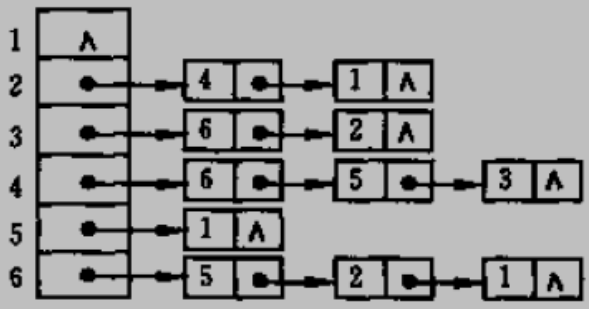
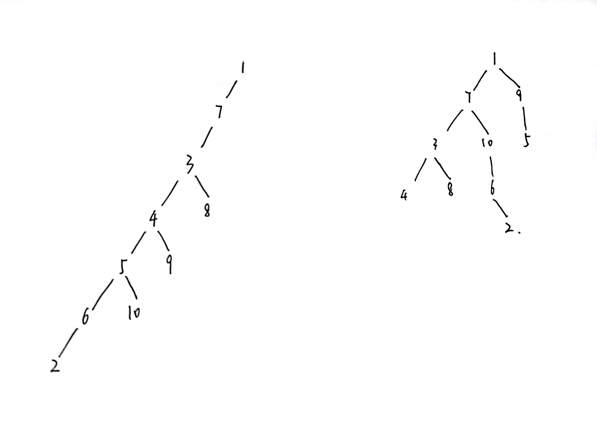
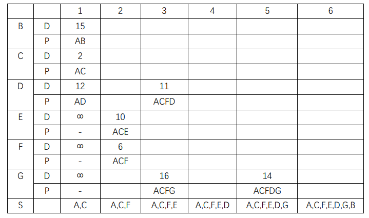

#### 7.1

(1)


(2)



(3)


(4)


---

#### 7.2

深度优先序列：1，7，3，4，5，6，2，10，9，8 \
广度优先序列：1，7，9，3，10，5，4，8，6，2



---

#### 7.3

(1)从 A 出发依次引入 CBHDGFE


(2)从最短边 FG 出发，FE, AC, AB, DH, CD, DG


---

#### 7.4

156234；561234；516234

---

#### 7.5



---

#### 7.8

```c++
#include <bits/stdc++.h>
#define MAX_VERTEX_NUM 20
#define InfoType int
#define VertexType int
#define N 20
typedef struct ArcNode
{
    int adjvex;
    struct ArcNode *nextarc;
} ArcNode;
typedef struct VNode
{
    ArcNode *firstarc;
} VNode, AdjList[MAX_VERTEX_NUM];
typedef struct
{
    AdjList vertices;
    int vexnum, arcnum;
} ALGraph;
int degree[MAX_VERTEX_NUM];
void cal_degree(ALGraph &G)
{
    int n = G.vexnum;
    for (int i = 1; i <= n; i++)
    {
        struct ArcNode *temp = G.vertices[i].firstarc;
        while (temp != nullptr)
        {
            degree[temp->adjvex]++;
            temp = temp->nextarc;
        }
    }
}
```

---

#### 7.9

```c++
int visited[MAX_VERTEX_NUM];
bool findroad_dfs(ALGraph &G, int rs, int ds)
{
    if (rs == ds)
        return true;
    struct ArcNode *temp = G.vertices[rs].firstarc;
    while (temp != nullptr)
    {
        if (!visited[temp->adjvex] && findroad(G, temp->adjvex, ds))
            return true;
    }
    return false;
}
```

---

#### 7.10

```c++
int visited[MAX_VERTEX_NUM];
bool findroad_bfs(ALGraph &G, int rs, int ds)
{
    std::queue<int> q;
    q.push(rs);
    while (!q.empty())
    {
        int temp = q.front();
        q.pop();
        if (visited[temp])
            continue;
        if (temp == ds)
            return true;
        struct ArcNode *node = G.vertices[temp].firstarc;
        while (node)
        {
            if (!visited[node->adjvex])
                q.push(node->adjvex);
            node = node->nextarc;
        }
    }
    return false;
}
```
