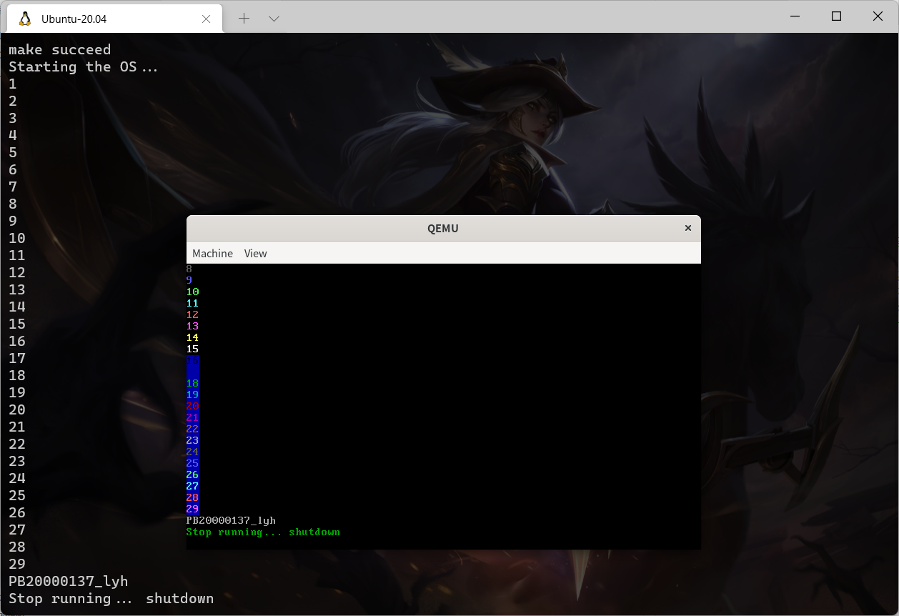

## lab2 实验报告

<p style="text-align:right">李远航</p>
<p style="text-align:right">PB20000137</p>

#### 一、实验内容

- 【必须】在源代码的语言层面，完成从汇编语言到 C 语言的衔接
- 【必须】在功能上，实现清屏、格式化输入输出，设备包括 VGA 和串口，接口符合要求
- 【必须】在软件层次和结构上，完成 multiboot_header、myOS 和 userApp 的划分，体现在文件录组织和 Makefile 组织上
- 【必须】采用自定义测试用例和用户（助教）测试用例相结合的方式进行验收
- 【必须】提供脚本完成编译和执行

#### 二、实验原理

- 软件的架构(框图)
  

#### 三、实验过程

##### 1. 代码的主流程及其实现


##### 2. 主要功能模块及其实现

- `vga.c`

  1. 设置光标位置

     直接使用`outb()`函数写入对应的端口

     ```c
     void set_cursor_pos(unsigned short int pos)
     {
         unsigned char row = (pos & 0xff00) >> 8;
         unsigned char col = pos & 0xff;
         outb(CURSOR_INDEX_PORT, CURSOR_LINE_REG);
         outb(CURSOR_DATA_PORT, row);
         outb(CURSOR_INDEX_PORT, CURSOR_COL_REG);
         outb(CURSOR_DATA_PORT, col);
     }
     ```

  2. 获取光标当前所在位置

     使用`outb()`和`inb()`获取行号和列号，用位运算获取位置信息

     ```c
     unsigned short int get_cursor_pos(void)
     {
         unsigned short int pos = 0;
         unsigned short int row, col;
         outb(CURSOR_INDEX_PORT, CURSOR_LINE_REG);
         row = inb(CURSOR_DATA_PORT);
         outb(CURSOR_INDEX_PORT, CURSOR_COL_REG);
         col = inb(CURSOR_DATA_PORT);
         pos += col;
         pos += (row) << 8;
         return pos;
     }

     ```

  3. 滚屏

     直接使用指针修改显存，除开最后一行的内存直接改为向后偏移八十个单位的值，最后一行，设置为底色黑色空白，最后将光标移动到最后一行开始的位置

     ```c
     void scroll_screen(void)
     {
         for (int i = 0; i < VGA_SCREEN_HEIGHT * VGA_SCREEN_WIDTH - VGA_SCREEN_WIDTH; i++)
         {
             unsigned short int *p, *q;
             p = (unsigned short int *)(i * 2 + VGA_BASE);
             q = (unsigned short int *)((i + 80) * 2 + VGA_BASE);
             *p = *q;
         }
         for (int i = VGA_SCREEN_HEIGHT * VGA_SCREEN_WIDTH - VGA_SCREEN_WIDTH; i < VGA_SCREEN_HEIGHT * VGA_SCREEN_WIDTH; i++)
         {
             unsigned short int *p;
             p = (unsigned short int *)(i * 2 + VGA_BASE);
             unsigned char blank = ' ';
             int color = 10;
             unsigned short int data = 0;
             data += color << 8;
             data += blank;
             *p = data;
         }
         set_cursor_pos(VGA_SCREEN_HEIGHT * VGA_SCREEN_WIDTH - VGA_SCREEN_WIDTH);
     }

     ```

  4. 向 vga 的特定光标位置 pos 输出一个字符

     直接修改当前光标位置显存的值，将光标的位置向后 $+1$

     ```c
     void put_char2pos(unsigned char c, int color, unsigned short int pos)
     {
         unsigned short int data = 0;
         data += color << 8;
         data += c;
         unsigned short int *p;
         p = (unsigned short int *)(pos * 2 + VGA_BASE);
         *p = data;
         set_cursor_pos(pos + 1);
     }

     ```

  5. 清屏

     将整个屏幕设置为底色黑色，内容空白，光标移到屏幕最开始

     ```c
     void clear_screen(void)
     {
         for (int i = 0; i < VGA_SCREEN_HEIGHT * VGA_SCREEN_WIDTH; i++)
         {
             unsigned short int *p;
             p = (unsigned short int *)(i * 2 + VGA_BASE);
             unsigned char blank = ' ';
             int color = 10;
             unsigned short int data = 0;
             data += color << 8;
             data += blank;
             *p = data;
         }
         set_cursor_pos(0);
     }

     ```

  6. 向 vga 的当前光标位置输出一个字符串，并移动光标位置到串末尾字符的下一位

     遍历字符串，调用输出一个字符的函数，对换行符号进行特判，每次输出字符前获取当前光标所在的位置，如果获取的光标位置超过了屏幕显示范围，则向上滚动一行

     ```c
     void append2screen(char *str, int color)
     {
         /* todo */
         int len = strlen(str);
         for (int i = 0; i < len; i++)
         {
             unsigned short int pos = get_cursor_pos();
             if (pos >= VGA_SCREEN_HEIGHT * VGA_SCREEN_WIDTH)
             {
                 scroll_screen();
                 pos = get_cursor_pos();
             }
             if (*(str + i) == '\n')
                 set_cursor_pos((pos / 80 + 1) * 80);
             else
                 put_char2pos(*(str + i), color, pos);
         }
         unsigned short int pos = get_cursor_pos();
         if (pos >= VGA_SCREEN_HEIGHT * VGA_SCREEN_WIDTH)
             scroll_screen();
     }
     ```

- `uart.c`

  1. 向串口输出一个字符

     直接向串口对应的端口，使用 outb 函数输出

     ```c
     void uart_put_char(unsigned char ch)
     {
         outb(UART_PORT, ch);
     }
     ```

  2. 向串口输出一个字符串

     遍历字符串，调用输出一个字符的函数`uart_put_char(unsigned char ch)`

     ```c
     void uart_put_chars(char *str)
     {
         int len = strlen(str);
         for (int i = 0; i < len; i++)
             uart_put_char(*(str + i));
     }
     ```

- `vsprintf.c`

  需要编写或移植一个格式串处理函数，这里选择编写一个可以处理基本的几种格式的转换

  ```c
  unsigned char hex_tab[] = {'0', '1', '2', '3', '4', '5', '6', '7', '8', '9', 'a', 'b', 'c', 'd', 'e', 'f'};

  int outc(const char c, char *buf, int index)
  {
      *(buf + index) = c;
      index++;
      return index;
  }

  int outs(const char *s, char *buf, int index) //输出字符串
  {
      while (*s != '\0')
      {
          *(buf + index) = *s;
          index++;
          s++;
      }
      return index;
  }

  int out_num(long n, int base, char lead, int maxwidth, char *buff, int index)
  {
      unsigned long m = 0;
      char buf[500], *s = buf + sizeof(buf);
      int count = 0, i = 0;
      *--s = '\0';
      if (n < 0)
          m = -n;
      else
          m = n;
      do
      {
          *--s = hex_tab[m % base];
          count++;
      } while ((m /= base) != 0);
      if (n < 0)
          *--s = '-';

      return outs(s, buff, index);
  }
  int vsprintf(char *buf, const char *fmt, va_list args)
  {
      /* todo */
      char lead = ' ';
      int maxwidth = 0;
      int index = 0;
      int argv = 0;
      for (; *fmt != '\0'; fmt++)
      {
          if (*fmt != '%')
          {
              *(buf + index) = *fmt;
              index++;
              continue;
          }

          fmt++;
          argv++;

          if (*fmt == '0')
          {
              lead = '0';
              fmt++;
          }

          while (*fmt >= '0' && *fmt <= '9')
          {
              maxwidth *= 10;
              maxwidth += (*fmt - '0');
              fmt++;
          }

          switch (*fmt)
          {
          case 'd':
              index = out_num(va_arg(args, int), 10, lead, maxwidth, buf, index);
              break;
          case 'o':
              index = out_num(va_arg(args, unsigned int), 8, lead, maxwidth, buf, index);
              break;
          case 'u':
              index = out_num(va_arg(args, unsigned int), 10, lead, maxwidth, buf, index);
              break;
          case 'x':
              index = out_num(va_arg(args, unsigned int), 16, lead, maxwidth, buf, index);
              break;
          case 'c':
              index = outc(va_arg(args, int), buf, index);
              break;
          case 's':
              index = outs(va_arg(args, char *), buf, index);
              break;

          default:
              index = outc(*fmt, buf, index);
              break;
          }
      }
      *(buf + index) = '\0';
      return argv;
  }
  ```

- `myPrintk.c`
  直接调用已经封装好的串口输出和 vga 输出函数

  ```c
  char kBuf[400];
  int myPrintk(int color, const char *format, ...)
  {
      va_list args;

      va_start(args, format);
      int cnt = vsprintf(kBuf, format, args);
      va_end(args);

      uart_put_chars(kBuf);
      append2screen(kBuf, color);

      return cnt;
  }
  char uBuf[400];
  int myPrintf(int color, const char *format, ...)
  {
      va_list args;

      va_start(args, format);
      int cnt = vsprintf(uBuf, format, args);
      va_end(args);

      uart_put_chars(uBuf);
      append2screen(uBuf, color);

      return cnt;
  }
  ```

##### 3. 源代码组织说明

- 项目结构
  ```bash
  ../lab2
  ├── Makefile
  ├── multibootheader
  │   └── multibootHeader.S
  ├── myOS
  │   ├── dev
  │   │   ├── Makefile
  │   │   ├── uart.c
  │   │   └── vga.c
  │   ├── i386
  │   │   ├── io.c
  │   │   └── Makefile
  │   ├── include
  │   │   ├── io.h
  │   │   ├── myPrintk.h
  │   │   ├── uart.h
  │   │   ├── vga.h
  │   │   └── vsprintf.h
  │   ├── lib
  │   │   ├── Makefile
  │   │   └── vsprintf.c
  │   ├── Makefile
  │   ├── myOS.ld
  │   ├── osStart.c
  │   ├── printk
  │   │   ├── Makefile
  │   │   └── myPrintk.c
  │   ├── start32.S
  │   └── userInterface.h
  ├── source2img.sh
  └── userApp
      ├── main.c
      └── Makefile
  ```
- Makefile 组织

##### 4. 代码布局说明

#### 四、编译过程

直接运行脚本文件

```bash
./source2img.sh
```

#### 五、运行结果


