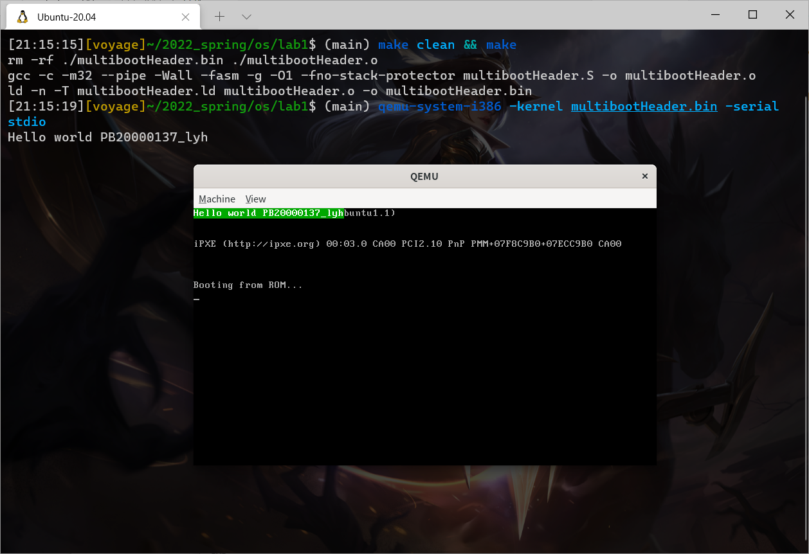

## lab1 实验报告

<p style="text-align:right">李远航</p>
<p style="text-align:right">PB20000137</p>

#### 一、实验内容

- 【非必须】建立 Ubuntu 和主机的共享文件夹
- 【必须】了解必要的 multiboot 协议相关内容
- 【必须】安装 QEMU，了解 QEMU 对 multiboot 的
  支持情况
- 【必须】遵守 multiboot 协议，写 multiboot header
- 【必须】直接在 VGA 的显存中写"helloworld"
- 【可选】使用串口输出"HELLOWORLD"
- 【必须】了解并掌握必要的汇编
- 【必须】了解 Makefile 和链接描述文件

#### 二、实验原理

- 使用 multiboot 协议，借助 qemu 实现 VGA 的简单输出
- movx source, destination
  - `movl`: 32 位
  - `movw`: 16 位
  - `movb`: &nbsp;8&nbsp; 位
- VGA 的输出：
  - 使用`movl $0x2f4b2f4f, 0xB8000`的格式，其中，前串字符表示输出的字符，后字符串表示输出的地址
  - 其中，每个字符需要 2 个字节，一个存放 ASCII 码，一个存放字符的显示颜色
- 串口的输出：使用以下格式
  ```asm
  movb $0x46, %al /* 输出字母F */
  movw $0x3F8, %dx
  outb %al, %dx /* put char */
  ```

#### 三、实验过程

- 根据实验原理及提供的链接文件，`makefile`内容编写代码(见`multibootHeader.S`)
- 运行编译过程
  ```bash
  make clean && make
  qemu-system-i386 -kernel multibootHeader.bin -serial stdio
  ```
- 运行截图
  
- 内存解释：
  - VGA：从 0xB8000 开始输出字符，每两个字符需要使用 32 位，即四个字节，则下一次输出地址向后加四个字节，同时需要注意每两个字节的先后循序要颠倒
  - 串口：0x3F8 为串口，通过 out 将 al 的值输出到串口 dx

#### 四、实验收获

- 学习安装实验所需的环境，熟悉 Linux 系统
- 初步学习了 qemu 的使用以及`multiboot`协议
- 初步了解学习了汇编语言
