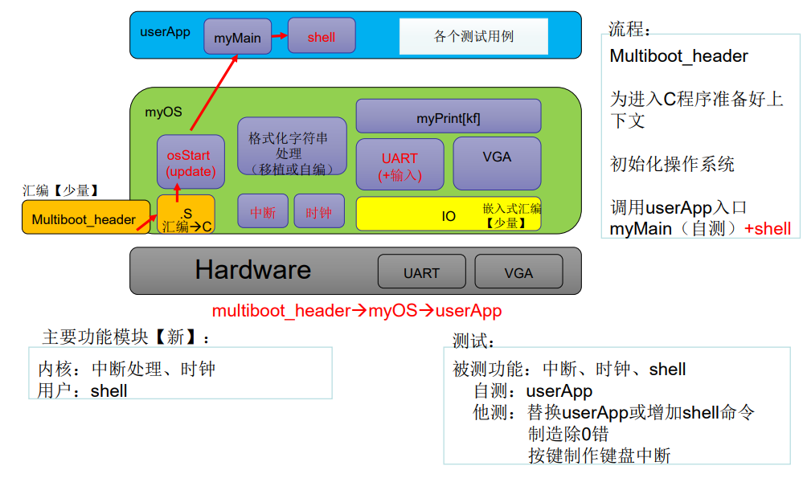
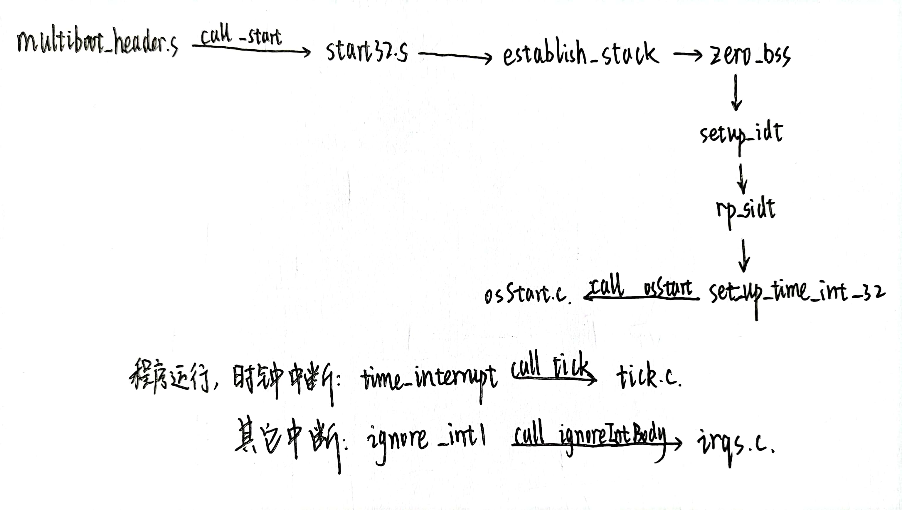
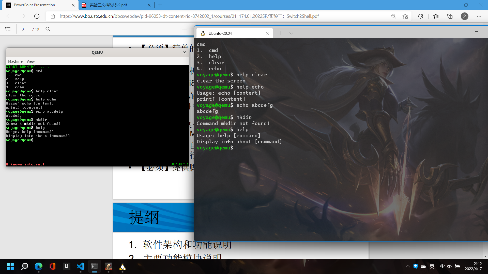

## lab3 实验报告

<p style="text-align:right">李远航</p>
<p style="text-align:right">PB20000137</p>

#### 一、实验内容

- 【必须】简单的 shell 程序，提供 cmd 和 help 命令，允许注册新的命令
- 【必须】中断机制和中断控制器 i8259A 初始化
- 【必须】时钟 i8253 和周期性时钟中断
- 【必须】VGA 输出的调整：
  - 左下角：时钟中断之外的其他中断，一律输出“unknown interrupt”
  - 右下角：从某个时间开始，大约每秒更新一次格式为：HH:MM:SS
- 【必须】采用自定义测试用例和用户（助教）测试用例相结合的方式进行验收
- 【必须】提供脚本完成编译和执行

#### 二、实验原理

- 软件的架构(框图)

  

#### 三、实验过程

##### 1. 代码的主流程



##### 2. 主要功能模块及其实现

- myOS/start32.S 中的 time_interrupt 和 ignore_int1 的填写

  ```x86asm
  time_interrupt:
      cld
      pushf
      pusha
      call tick
      popa
      popf
      iret

      .p2align 4
  ignore_int1:
      cld
      pusha
      call ignoreIntBody
      popa
      iret
  ```

- myOS/dev/i8253.c 和 myOS/dev/i8259A.c 的填写

  ```c
  void init8253(void)
  {
      //你需要填写它
      unsigned short fre = 1193180 / 100;
      outb(0x43, 0x34);
      outb(0x40, (unsigned char)(fre & 0xff));
      outb(0x40, (unsigned char)((fre >> 8) & 0xff));
      outb(0x21, (unsigned char)(inb(0x21) & 0xfe));
  }
  void init8259A(void)
  {
      //你需要填写它
      //屏蔽所有中断源
      outb(0x21, 0XFF);
      outb(0xA1, 0xFF);
      //主片初始化
      outb(0x20, 0x11);
      outb(0x21, 0x20);
      outb(0x21, 0x04);
      outb(0x21, 0x3);
      //从片初始化
      outb(0xA0, 0x11);
      outb(0xA1, 0x28);
      outb(0xA1, 0x02);
      outb(0xA1, 0x01);
  }
  ```

- myOS/i386/irq.s 的填写

  ```x86asm
  enable_interrupt:
      sti
      ret
      .globl disable_interrupt
  disable_interrupt:
      cli
      ret
  ```

- myOS/kernel/tick.c 和 myOS/kernel/wallClock.c 的填写

  ```c
  void tick(void)
  {
      system_ticks++;
      int temp = system_ticks / 100;
      HH = temp / (60 * 60);
      MM = temp / 60 - HH * 60;
      SS = temp % 60;
      oneTickUpdateWallClock(HH, MM, SS);
      return;
  }
  void setWallClock(int HH, int MM, int SS)
  {
      char time_str[9];
      time_str[0] = '0' + HH / 10;
      time_str[1] = '0' + HH % 10;
      time_str[2] = ':';
      time_str[3] = '0' + MM / 10;
      time_str[4] = '0' + MM % 10;
      time_str[5] = ':';
      time_str[6] = '0' + SS / 10;
      time_str[7] = '0' + SS % 10;
      time_str[8] = '\0';

      unsigned short int *p;
      unsigned short int pos = 80 * 25 - 8;
      unsigned short int data;
      unsigned short int base = 0x2 << 8;
      p = (unsigned short int *)(VGA_BASE + pos * 2);
      for (int i = 0; i < 9; i++)
      {
          data = base + time_str[i];
          *p = data;
          p += 1;
      }
      return;
  }
  void getWallClock(int *HH, int *MM, int *SS)
  {
      unsigned short int *p;
      unsigned short int pos = 80 * 25 - 8;
      p = (unsigned short int *)(VGA_BASE + pos * 2);

      char c = (*p) & 0xff;
      *HH = (c - '0') * 10;
      p += 2;
      c = (*p) & 0xff;
      *HH += (c - '0');

      p += 2 * 2;
      c = (*p) & 0xff;
      *MM = (c - '0') * 10;
      p += 2;
      c = (*p) & 0xff;
      *MM += (c - '0');

      p += 2 * 2;
      c = (*p) & 0xff;
      *SS = (c - '0') * 10;
      p += 2;
      c = (*p) & 0xff;
      *SS += (c - '0');
      return;
  }
  ```

- userApp/startShell.c 的填写

  新增加了 clear 清屏和 echo 输出函数，简单修改了终端窗口的颜色，适应了\b 的功能，添加了 split 函数

  ```c
  int func_cmd(int argc, char (*argv)[8])
  {
      if (argc != 1)
          myPrintk(0x7, "unrecognized command line option\n\n");
      else
      {
          myPrintk(0x7, "1.  ");
          myPrintk(0x7, cmd.name);
          myPrintk(0x7, "\n");
          myPrintk(0x7, "2.  ");
          myPrintk(0x7, help.name);
          myPrintk(0x7, "\n");
          myPrintk(0x7, "3.  ");
          myPrintk(0x7, clear.name);
          myPrintk(0x7, "\n");
          myPrintk(0x7, "4.  ");
          myPrintk(0x7, echo.name);
          myPrintk(0x7, "\n");
      }
  }
  int judge_command(char *str)
  {
      if (str[0] == 'c' && str[1] == 'm' && str[2] == 'd' && str[3] == '\0')
          return 1;
      if (str[0] == 'h' && str[1] == 'e' && str[2] == 'l' && str[3] == 'p' && str[4] == '\0')
          return 2;
      if (str[0] == 'c' && str[1] == 'l' && str[2] == 'e' && str[3] == 'a' && str[4] == 'r' && str[5] == '\0')
          return 3;
      if (str[0] == 'e' && str[1] == 'c' && str[2] == 'h' && str[3] == 'o' && str[4] == '\0')
          return 4;
      return 0;
  }
  int func_help(int argc, char (*argv)[8])
  {
      if (argc == 1)
          myPrintk(0x7, help.help_content);
      else
      {
          if (judge_command(argv[1]) == 1)
              myPrintk(0x7, cmd.help_content);
          else if (judge_command(argv[1]) == 2)
              myPrintk(0x7, help.help_content);
          else if (judge_command(argv[1]) == 3)
              myPrintk(0x7, clear.help_content);
          else if (judge_command(argv[1]) == 4)
              myPrintk(0x7, echo.help_content);
          else
              myPrintk(0x7, "No Such Command please use cmd to see more information");
      }
      myPrintk(0x7, "\n");
  }
  int func_clear(int argc, char (*argv)[8])
  {
      if (argc != 1)
          myPrintk(0x7, "unrecognized command line option\n");
      else
          clear_screen();
  }
  int func_echo(int argc, char (*argv)[8])
  {
      myPrintk(0x7, argv[1]);
      myPrintk(0x7, "\n");
  }
  int split(char *str, char (*argv)[8], int len)
  {
      int iter = 0;
      int num = 0;
      int i = 0;
      while (iter < len)
      {
          if (str[iter] != ' ')
          {
              argv[num][i] = str[iter];
              i++;
              iter++;
          }
          else
          {
              argv[num][i] = '\0';
              num++;
              i = 0;
              iter++;
          }
      }
      argv[num][i] = '\0';
      num++;
      return num;
  }
  void startShell(void)
  {
      //我们通过串口来实现数据的输入
      char BUF[256];   //输入缓存区
      int BUF_len = 0; //输入缓存区的长度

      int argc;
      char argv[8][8];

      do
      {
          BUF_len = 0;
          myPrintk_only_vga(0xa, "voyage@qemu");
          myPrintk_only_vga(0xf, "$ ");

          uart_put_chars("\e[32;1mvoyage@qemu\e[0m\e[1m$ \e[0m");

          char str_for_out[2];
          str_for_out[1] = '\0';

          while ((BUF[BUF_len] = uart_get_char()) != '\r')
          {
              if (BUF[BUF_len] == 127 && BUF_len == 0)
              {
                  continue;
              }
              else if (BUF[BUF_len] == 127)
              {
                  myPrintk(0x7, "\b \b");
                  BUF_len--;
                  continue;
              }
              uart_put_char(BUF[BUF_len]); //将串口输入的数存入BUF数组中
              str_for_out[0] = BUF[BUF_len];
              myPrintk_only_vga(0x7, str_for_out);
              BUF_len++; // BUF数组的长度加
          }
          BUF[BUF_len] = '\0';

          myPrintk(0x7, "\n");
          // OK,助教已经帮助你们实现了“从串口中读取数据存储到BUF数组中”的任务，接下来你们要做
          //的就是对BUF数组中存储的数据进行处理(也即，从BUF数组中提取相应的argc和argv参
          //数)，再根据argc和argv，寻找相应的myCommand ***实例，进行***.func(argc,argv)函数
          //调用。

          //比如BUF中的内容为 “help cmd”
          //那么此时的argc为2 argv[0]为help argv[1]为cmd
          //接下来就是 help.func(argc, argv)进行函数调用即可
          argc = split(BUF, argv, BUF_len);
          if (judge_command(argv[0]) == 1)
              func_cmd(argc, argv);
          else if (judge_command(argv[0]) == 2)
              func_help(argc, argv);
          else if (judge_command(argv[0]) == 3)
              func_clear(argc, argv);
          else if (judge_command(argv[0]) == 4)
              func_echo(argc, argv);
          else if (BUF[0] == '\0')
          {
          }
          else
          {
              myPrintk(0x7, "Command");
              myPrintk(0xf, " %s ", BUF);
              myPrintk(0x7, "not found!\n");
          }
      } while (1);
  }
  ```

##### 3. 源代码组织说明

- 项目结构

```bash
├── compile_flags.txt
├── Makefile
├── multibootheader
│   └── multibootHeader.S
├── myOS
│   ├── dev
│   │   ├── i8253.c
│   │   ├── i8259A.c
│   │   ├── Makefile
│   │   ├── uart.c
│   │   └── vga.c
│   ├── i386
│   │   ├── io.c
│   │   ├── irq.S
│   │   ├── irqs.c
│   │   └── Makefile
│   ├── include
│   │   ├── i8253.h
│   │   ├── i8259A.h
│   │   ├── io.h
│   │   ├── irqs.h
│   │   ├── myPrintk.h
│   │   ├── tick.h
│   │   ├── uart.h
│   │   ├── vga.h
│   │   ├── vsprintf.h
│   │   └── wallClock.h
│   ├── kernel
│   │   ├── Makefile
│   │   ├── tick.c
│   │   └── wallClock.c
│   ├── Makefile
│   ├── myOS.ld
│   ├── osStart.c
│   ├── printk
│   │   ├── Makefile
│   │   ├── myPrintk.c
│   │   └── vsprintf.c
│   └── start32.S
├── source2run.sh
└── userApp
    ├── main.c
    ├── Makefile
    └── startShell.c
```

- Makefile 组织

```bash
.
├── MULTI_BOOT_HEADER
│   └── output/multibootheader/multibootHeader.o
└── OS_OBJS
    ├── MYOS_OBJS
    │   ├── output/myOS/osStart.o
    │   ├── output/myOS/start32.o
    │   ├── DEV_OBJS
    │   │   ├── output/myOS/dev/uart.o
    │   │   ├── output/myOS/dev/vga.o
    │   │   ├── output/myOS/dev/i8259A.o
    │   │   └── output/myOS/dev/i8253.o
    │   ├── I386_OBJS
    │   │   ├── output/myOS/i386/io.o
    │   │   ├── output/myOS/i386/irqs.o
    │   │   └── output/myOS/i386/irq.o
    │   ├── PRINTK_OBJS
    │   │   ├── output/myOS/printk/myPrintk.o
    │   │   └── output/myOS/printk/vsprintf.o
    │   └── KERNEL_OBJS
    │   │   ├── output/myOS/kernel/tick.o
    │   │   └── output/myOS/kernel/wallClock.o
    └── USER_APP_OBJS
        ├── output/userApp/main.o
        └── output/userApp/startShell.o
```

##### 4. 代码布局说明

| Section           | Offset (Base = 1M) |
| ----------------- | ------------------ |
| .multiboot_header | 0                  |
| .text             | 8                  |
| .data             | 16                 |
| .bss              | 16                 |
| \_end             | 16                 |

#### 四、编译运行过程

直接运行脚本文件

```bash
./source2img.sh
```

根据提示重定向串口输入

脚本的执行:

- 编译各个文件，生成相应的 .o 目标文件
- 根据链接描述文件，将各 .o 目标文件进行链接，生成`myOS.elf`文件
- 使用 qemu，调用上一步生成的文件，进行模拟

#### 五、运行结果



#### 六、实验收获

- 熟悉了汇编到 C 的过程
- 熟悉了操作系统相关的接口
- 学习了 shell 脚本
- 熟悉了终端机制
- 学习了 HOOK 相关机制
  - 实现了机制与策略相分离，提供了用户重新编写 mysetWallClock，并调用 setWallClockHook(mysetWallClock)的权利
