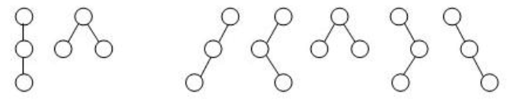
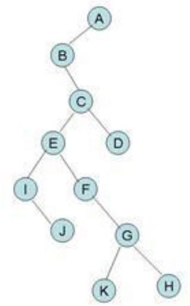
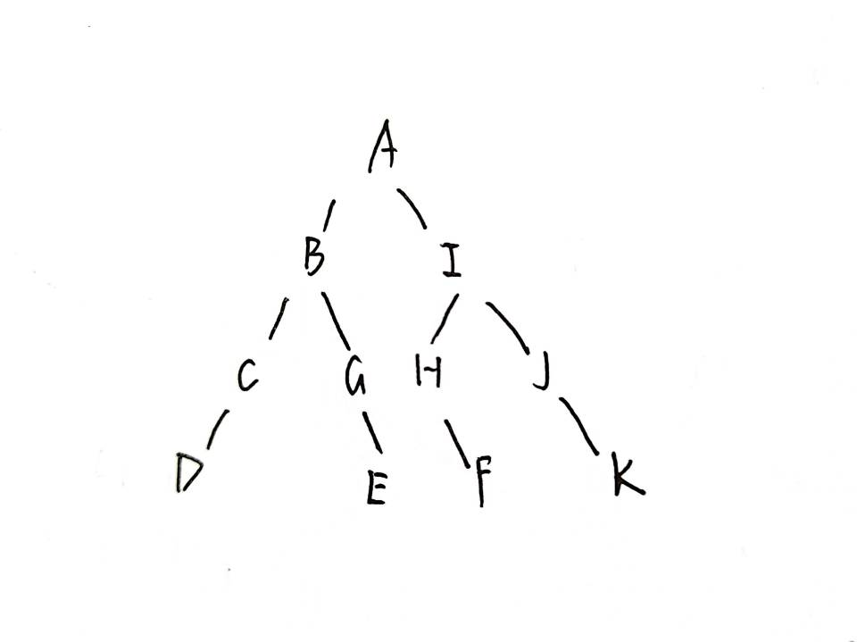
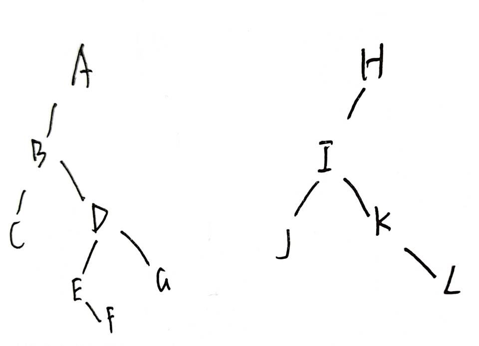
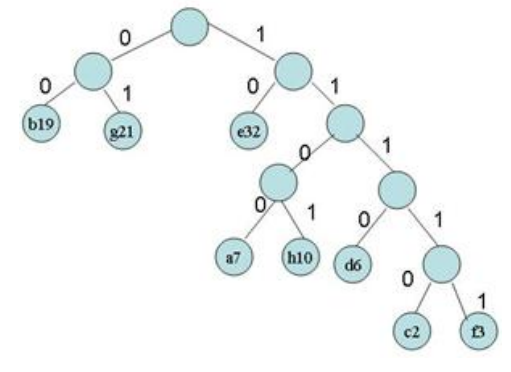

#### 6.1



---

#### 6.2

​ 一个子树

---

#### 6.3

1. 只有根结点的二叉树或非叶子结点只有右子树的二叉树
2. 只有根结点的二叉树或非叶子结点只有左子树的二叉树
3. 只有根节点的二叉树

---

#### 6.4

1. 第 $m$ 层 $k^{m-1}$ 个结点
2. $\lfloor\frac{i+k-2}{k}\rfloor$
3. $i\cdot k+j-(k-1)$
4. $(i-1)\%k\neq0$,其兄弟编号为$i+1$

---

#### 6.8



先根遍历序列：ABCEIJFGKHD；后根遍历序列：BIJEFKGHCDA

---

#### 6.9


---

#### 6.11



---

#### 6.13



---

#### 6.14



(2) a:1100; b:00; c:11110; d:1110; e:10; f:11111; g:01; h:1101

(3) 261

#### 6.16

```c
struct BiTree
{
    int val;
    struct BiTree *left, *right;
};
struct BiTree *change_left_right(struct BiTree *p)
{
    if (p == nullptr)
        return p;
    struct BiTree *temp = p->left;
    p->left = change_left_right(p->right);
    p->right = change_left_right(temp);
    return p;
}
```

#### 6.22

```c
typedef struct CSNode
{
    int data;
    struct CSNode *firstchild, *nextsibling;
    CSNode() : firstchild(nullptr), nextsibling(nullptr){};
} CSNode, *CSTree;
int judge_h(CSTree p)
{
    if (p == nullptr)
        return 0;
    int maxh = 1;
    if (p->firstchild != nullptr)
        maxh += judge_h(p->firstchild);
    CSTree temp = p->nextsibling;
    while (temp != nullptr)
    {
        int temp_h = judge_h(temp);
        maxh = std::max(maxh, temp_h);
        temp = temp->nextsibling;
    }
    return maxh;
}
```

#### 6.23

```c
struct BiTree
{
    int val;
    struct BiTree *left, *right;
};
int cal_K(struct BiTree *head, int k)
{
    if (head == nullptr)
        return 0;
    if (k == 1)
        return 1;
    else
        return cal_K(head->left, k - 1) + cal_K(head->right, k - 1);
}
```
