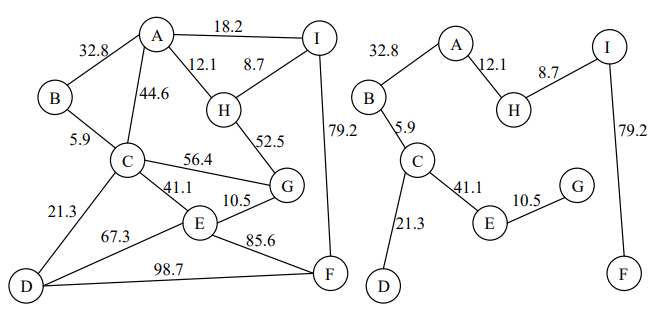

# 实验五 管道铺设施工的最佳方案

<p style="text-align:right">李远航</p>
<p style="text-align:right">PB20000137</p>

#### 一、问题描述

##### 1. 实验内容

需要在某个城市 n 个居民小区之间铺设煤气管道，则在这 n 个居民小区之间只需要铺设 n-1 条管道即可。假设任意两个小区之间都可以铺设管道，但由于地理环境不同，所需要的费用也不尽相同。选择最优的方案能使总投资尽能小，这个问题即为求无向网的最小生成树。

##### 2. 实验要求

在可能假设的 m 条管道中，选取 n-1 条管道，使得既能连通 n 个小区，又能使总投资最小。每条管道的费用以网中该边的权值形式给出，网的存储采用邻接表的结构。

##### 3. 测试数据

使用下图给出的无线网数据作为程序的输入，求出最佳铺设方案。右侧是给出的参考解。


##### 4. 输入输出

参考示例中图的创建方式，从键盘或文件读入上图中的无向网，以顶点对(i,j)的形式输出最小生成树的边。

#### 二、需求分析

- 需要建立适当的数据结构存储数据
- 需要在建立的数据结构上实现求最小生成树的算法

#### 三、概要设计

- 使用邻接表存储数据
- 使用 Kruskal 算法

#### 四、具体实现

- 存储数据结构的定义

```c++
#define MAX_vex 50
typedef struct ArcNode
{
    int adjvex;
    struct ArcNode *nextarc;
    float info;
} ArcNode;
typedef struct VNode
{
    char data;
    ArcNode *firstarc;
} VNode, AdjList[MAX_vex];
typedef struct
{
    AdjList vertices;
    int vexnum, arcnum;
} ALGraph;
```

- 在图上插入数据

```c++
void insert(ALGraph &G, int v1, int v2, float weight)
{
    ArcNode *p = new ArcNode;
    p->adjvex = v2;
    p->info = weight;
    p->nextarc = nullptr;
    if (G.vertices[v1].firstarc == nullptr)
        G.vertices[v1].firstarc = p;
    else
    {
        ArcNode *q = G.vertices[v1].firstarc;
        while (q->nextarc != nullptr)
            q = q->nextarc;
        q->nextarc = p;
    }
}
```

- Kruskal 算法:

  使用`std::pair<int,int>`存储当前选取的边，每次搜索出最短的边，并保证不构成圈

```c++
void Kruskal(ALGraph &G)
{
    int visit[G.vexnum];
    int index = 1;
    memset(visit, 0, sizeof(visit));
    int min = INT_MAX;
    std::pair<int, int> temp;
    for (int i = 0; i < G.vexnum; i++)
    {
        min = INT_MAX;
        for (int j = 0; j < G.vexnum; j++)
        {
            ArcNode *p = G.vertices[j].firstarc;
            while (p != NULL)
            {
                if (p->info < min)
                {
                    if (visit[j] == 0 || visit[p->adjvex] == 0 || visit[j] != visit[p->adjvex])
                    {
                        temp = std::make_pair(j, p->adjvex);
                        min = p->info;
                    }
                }
                p = p->nextarc;
            }
        }
        if (min == INT_MAX)
            break;
        std::cout << '(' << (char)(temp.first + 'A') << ',' << (char)(temp.second + 'A') << ')' << std::endl;
        if (visit[temp.first] == 0 && visit[temp.second] == 0)
        {
            visit[temp.first] = index;
            visit[temp.second] = index;
            index++;
        }
        else if (visit[temp.first] == 0)
            visit[temp.first] = visit[temp.second];
        else if (visit[temp.second] == 0)
            visit[temp.second] = visit[temp.first];
        else
        {
            int same = visit[temp.second];
            for (int s = 0; s < G.vexnum; s++)
                if (visit[s] == same)
                    visit[s] = visit[temp.first];
        }
    }
}
```

- 文件读取

```c++
int main()
{
    std::ifstream infile("./bin/graph.txt", std::ios::in);
    ALGraph G;
    memset(G.vertices, 0, sizeof(G.vertices));

    infile >> G.vexnum >> G.arcnum;
    for (int i = 0; i < G.vexnum; i++)
    {
        G.vertices[i].data = 'A' + i;
        G.vertices[i].firstarc = nullptr;
    }

    int v1, v2;
    float weight;
    for (int i = 0; i < G.arcnum; i++)
    {
        infile >> v1 >> v2 >> weight;
        insert(G, v1, v2, weight);
    }

    Kruskal(G);

    infile.close();
    return 0;
}
```

#### 五、编译过程

- 文件结构

```bash
├── bin
│   ├── graph
│   └── graph.txt
└── graph.cpp
```

- 编译运行

```bash
$ g++ graph.cpp -o ./bin/graph
$ ./bin/graph
```

#### 六、运行结果

```bash
(B,C)
(H,I)
(E,G)
(A,H)
(C,D)
(A,B)
(C,E)
(F,I)
```

#### 七、实验收获

- 熟悉了图的存储结构
- 熟悉了最小生成树的概念以及搜索最小生成树的算法
- 提升了编程能力
