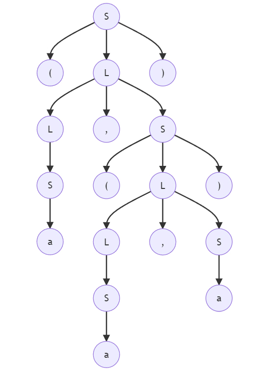
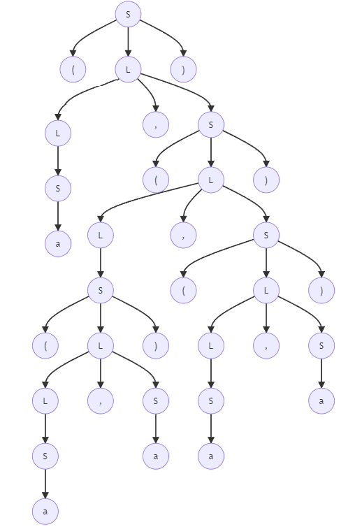

##### 3.1-a

1. (a,(a,a))

   

2. (a,((a,a),(a,a)))

   

##### 3.1-c

1. (a,(a,a))

```bash
S->(L)->(L,S)->(L,(L))->(L,(L,S))->(L,(L,a))->(L,(S,a))->(L,(a,a))->(S,(a,a))->(a,(a,a))
```

2. (a,((a,a),(a,a)))

```bash
S->(L)->(L,S)->(L,(L))->(L,(L,S))->(L,(L,(L)))->(L,(L,(L,S)))->(L,(L,(L,a)))->(L,(L,(S,a)))->(L,(L,(a,a)))->(L,(S,(a,a)))->(L,((L),(a,a)))->(L,((L,S),(a,a)))->(L,((L,a),(a,a)))->(L,((S,a),(a,a)))->(L,((a,a),(a,a)))->(S,((a,a),(a,a)))->(a,((a,a),(a,a)))
```

##### 3.2-a

```bash
S->aSbS->abSaSbS->abaSbS->ababS->abab
S->aSbS->abS->abaSbS->ababS->abab
```

##### 3.3

```bash
S-> not T | T
T-> F and F | F
F-> L or L | L
L-> true | false | (S)
```
