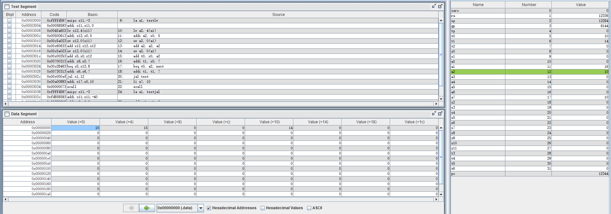
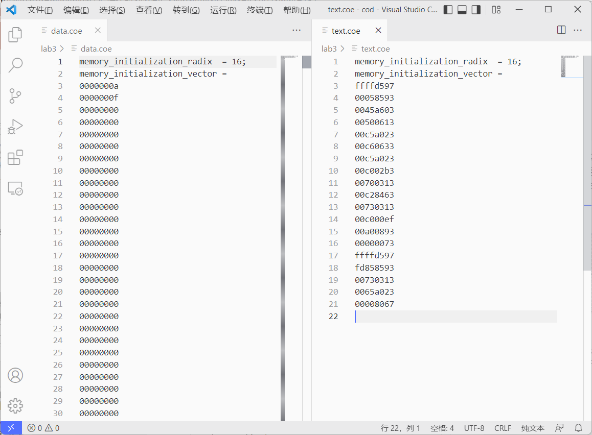
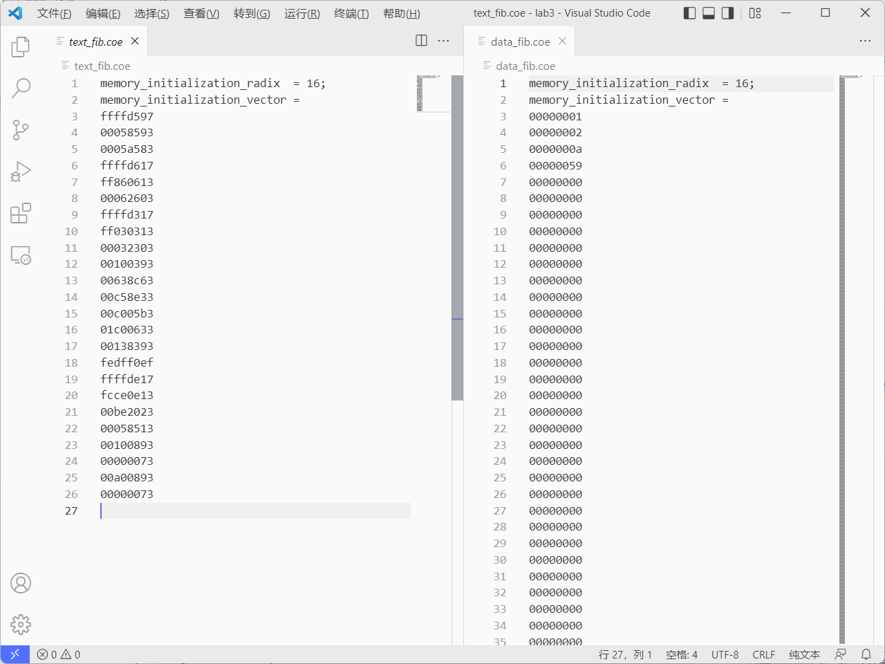

## Lab3 汇编程序设计

<p style="text-align:right"> 李远航</p>
<p style="text-align:right"> PB20000137</p>

#### 1. 实验内容

- 熟悉 RISC-V 汇编指令的格式
- 熟悉 CPU 仿真软件 Ripes，理解汇编指令执行的基本原理（数据通路和控制器的协调工作过程）
- 熟悉汇编程序的基本结构，掌握简单汇编程序的设计
- 掌握汇编仿真软件 RARS(RISC-V Assembler & Runtime Simulator)的使用方法，会用该软件进行汇编程序的仿真、调试以及生成 CPU 测试需要的指令和数据文件（COE）
- 理解 CPU 调试模块 PDU 的使用方法

#### 2. 实验环境

- PC 一台
- Ripes
- Rars

#### 3. 实验过程

##### (1)理解并仿真 RIPES 示例汇编程序

加载 Ripes 示例汇编程序 (Console Printing)-> 选择单周期 CPU 数据通路 -> 单步执行程序 -> 观察数据通路控制信号和寄存器内容的变化

- 示例一为计算两个复数相乘的程序
- 示例二为控制台输出的程序
- 示例三为计算阶乘的程序

##### (2)设计汇编程序，验证 6 条指令功能

Rars 软件设计汇编程序 -> 单步运行程序 -> 人工检查 -> 生成 COE 文件

```mipsasm
.data
testlw:		.word	10, 15
testsw:		.word	0
testbeq: 	.word   0
testjal:	.word   0

.text
main:
    la a1, testlw
    lw a2, 4(a1)
    addi a2, x0, 5
    sw a2, 0(a1)
    add a2, a2, a2
    sw a2, 0(a1)
    add t0, x0, a2
    addi t1, x0, 7
    beq t0, a2, next
    addi t1, t1, 7
next:
    jal test
    li a7, 10
    ecall
test:
    la a1, testjal
    addi t1, t1, 7
    sw t1, 0(a1)
    jr x1
```

该程序取出 15 给 a2,再将 a2 利用立即数加为 5,并将其存储到 a1 的位置,再将 a2 和自身相加,再存到 a1 的位置,接着将 t0 a2 设置成相等的值，测试 beq 功能，最后测试 jal,将 t1 存储到对应位置

程序运行最后的数据映像:



生成 coe 文件如下所示:



##### (3) Rars 软件设计汇编程序，实现计算斐波那契—卢卡斯数列（数列前两项为 1，2），并生成 COE 文件

代码如下:

```mipsasm
.data
first:      .word       1
second:     .word       2
goal:       .word       20
outans:     .word       0

.text
main:
    la a1, first
    lw a1, 0(a1)
    la a2, second
    lw a2, 0(a2)
    la t1, goal
    lw t1, 0(t1)
    addi t2, x0, 1
loop:
    beq t2, t1, exit
    add t3, a1, a2
    add a1, x0, a2
    add a2, x0, t3
    addi t2, t2, 1
    jal loop
exit:
    la t3, outans
    sw a1, 0(t3)
    addi a0, a1, 0
    li a7, 1
    ecall
    li a7 10
    ecall
```

该程序通过 label:`goal`取得需要计算的第 goal 项元素,并将计算得到的结果,储存到`outans`处

测试`goal`=20 时，console 的输出:


计算可以发现第 20 项的值与该汇编程序计算出的答案相同
coe 文件:



#### 4. 实验收获

- 学习了 RISC-V 汇编程序的书写
- 学习了仿真软件 Ripes 和 Rars 的使用
- 对单周期 CPU 有了更深的认识
