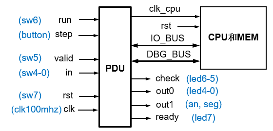
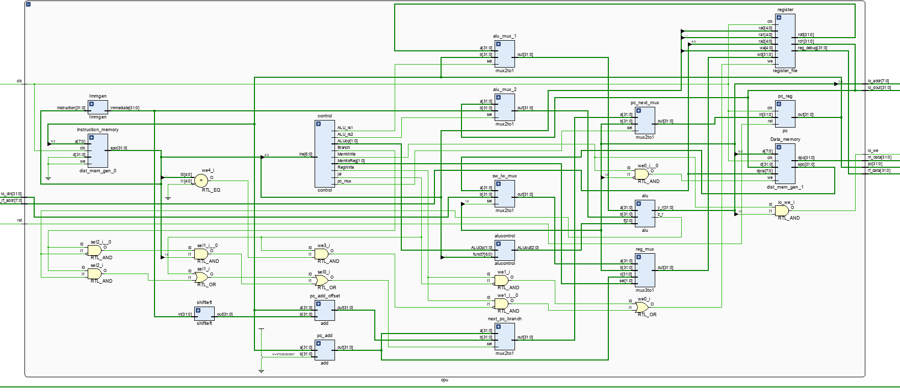
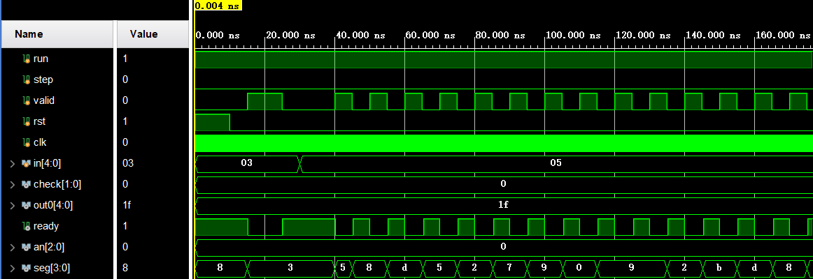

## Lab4 单周期 CPU 设计

<p style="text-align:right"> 李远航</p>
<p style="text-align:right"> PB20000137</p>

#### 1. 实验内容

- 理解 CPU 的结构和工作原理
- 掌握单周期 CPU 的设计和调试方法
- 熟练掌握数据通路和控制器的设计和描述方法

#### 2. 实验环境

- PC 一台
- Vivado 2020.2
- fpgaol.ustc.edu.cn

#### 3. 逻辑结构



#### 4. 数据通路



- alu 前两个操作数都设计了 MUX，除寄存器内容外，加入了 PC 和立即数扩展
- 寄存器写入端口前的 MUX 增加了 PC+4
- PC 写回端口增加了 ALU 的计算结果

控制信号说明:

- Branch: 判断是否分支
- MemRead: 判断是否需要读取 memory
- MemWrite: 判断是否需要写入 memory
- RegWrite: 判断是否需要写入寄存器
- ALU_rs1: alu 第一个操作数选择信号
- ALU_rs2: alu 第二个操作数选择信号
- jal: 是否在执行 jal 指令
- pc_mux: 判断是否写回 alu_result
- ALUop: alu 控制信号
- MemtoReg: 寄存器写回数据控制信号

#### 5. 具体指令的实现过程

&nbsp;&nbsp;&nbsp;&nbsp;&nbsp;&nbsp;_**未标出控制信号为 0**_

- add/sub: 从寄存器取两个操作数，通过 alu 计算，将结果写回寄存器
  - regWrite = 1
  - ALUop = 2'b10
  - MemtoReg = 2'b1
- addi: 从寄存器取一个操作数，立即数为另一个操作数，alu 计算，写回寄存器
  - RegWrite = 1
  - ALU_rs2 = 1
  - ALUop = 2'b10
  - MemtoReg = 2'b1
- auipc: alu 操作数分别选择 PC 和立即数扩展，在立即数扩展内对立即数进行左移，写回寄存器
  - RegWrite = 1
  - ALU_rs1 = 1
  - ALU_rs2 = 1
  - MemtoReg = 2'b1
- lw: 从寄存器取一个操作数，立即数为另一个操作数，alu 计算出地址，从 memory 读取返回寄存器
  - MemRead = 1
  - RegWrite = 1
  - ALU_rs2 = 1
- sw: 从寄存器取一个操作数，立即数为另一个操作数，alu 计算出地址，将寄存器的值存入 memory
  - MemWrite = 1
  - ALU_rs2 = 1
- beq/blt:从寄存器取两个操作数，alu 进行减法计算，通过指令下标 14 区分 beq 和 blt，再根据计算结果正负进行跳转
  - Branch = 1
  - ALUop = 2'b01
- jal: 直接将 PC+4 写回寄存器，同时使用 jal 控制信号跳转
  - RegWrite = 1
  - jal = 1
  - MemtoReg = 2'b10
- jalr: 直接将 PC+4 写回寄存器，alu 取寄存器和立即数计算，alu_result 写回 PC
  - RegWrite = 1
  - ALU_rs2 = 1
  - jal = 1
  - pc_mux = 1
  - MemtoReg = 2'b10

#### 6. 仿真



#### 7. 运行截图


#### 8. 实验收获

- 设计了单周期 cpu 的数据通路
- 熟悉了单周期 cpu 的控制信号
- 能够使用设计的 cpu 运行简单的程序

#### 9. 源码

```verilog
module top(
    input run, step, valid, rst, clk,
    input [4:0] in,
    output [1:0] check,
    output [4:0] out0,
    output ready,
    output [2:0] an,
    output [3:0] seg
);
    wire clk_cpu;
    //IO_BUS
    wire [7:0] io_addr;
    wire [31:0] io_dout;
    wire io_we;
    wire [31:0] io_din;
    //Debug_BUS
    wire [7:0] m_rf_addr;
    wire [31:0] rf_data;
    wire [31:0] m_data;
    wire [31:0] pc;

    pdu_1cycle pdu(
        .clk(clk),
        .rst(rst),
        .run(run),
        .step(step),
        .clk_cpu(clk_cpu),
        .valid(valid),
        .in(in),
        .check(check),
        .out0(out0),
        .an(an),
        .seg(seg),
        .ready(ready),
        .io_addr(io_addr),
        .io_dout(io_dout),
        .io_we(io_we),
        .io_din(io_din),
        .m_rf_addr(m_rf_addr),
        .rf_data(rf_data),
        .m_data(m_data),
        .pc(pc)
    );
    cpu cpu(
        .clk(clk_cpu),
        .rst(rst),
        .io_addr(io_addr),
        .io_dout(io_dout),
        .io_we(io_we),
        .io_din(io_din),
        .m_rf_addr(m_rf_addr),
        .rf_data(rf_data),
        .m_data(m_data),
        .pc(pc)
    );
endmodule
module  cpu (
    input clk,
    input rst,

    //IO_BUS
    output [7:0] io_addr,
    output [31:0] io_dout,
    output io_we,
    input [31:0] io_din,

    //Debug_BUS
    input [7:0] m_rf_addr,
    output [31:0] rf_data,
    output [31:0] m_data,
    output [31:0] pc
);


    wire [31:0] pc_next, pc_now, pc_4;
    wire [31:0] ins;
    wire [31:0] Read_data_1, Read_data_2;
    wire [31:0] Register_write;
    wire [31:0] immediate_num;
    wire [31:0] alu_op1, alu_op2, ALU_result;
    wire ALU_ZERO;
    wire [2:0] alu_control;

    wire Branch, MemRead, MemWrite, RegWrite, ALU_rs1, ALU_rs2, jal, pc_mux;
    wire [1:0] ALUop, MemtoReg;

    wire [31:0]  pc_offset,pc_b_type,pc_branch;

    wire [31:0] memory_read_data, Data_memory_read;

    assign pc = pc_now;
    assign io_addr = ALU_result[7:0];
    assign io_dout = Read_data_2;
    assign io_we = MemWrite&&(ALU_result[10]);

    add pc_add(
        .a(pc_now),
        .b(32'd4),
        .out(pc_4)
    );

    pc pc_reg(
        .in(pc_next),
        .rst(rst),
        .clk(clk),
        .out(pc_now)
    );

    dist_mem_gen_0 Instruction_memory (
        .clk(clk),
        .we(1'b0),
        .d(0),
        .a(pc_now[9:2]),
        .spo(ins)
    );

    dist_mem_gen_1 Data_memory (
        .a(ALU_result[9:2]),
        .d(Read_data_2),
        .dpra(m_rf_addr),
        .clk(clk),
        .we(MemWrite&&(~ALU_result[10])),
        .spo(memory_read_data),
        .dpo(m_data)
    );

    reg jal_x0;
    always@(*) begin
        if(jal && ins[11:7] == 5'b00000)
            jal_x0 = 1;
        else
            jal_x0 = 0;
    end

    register_file register(
        .clk(clk),
        .ra0(ins[19:15]),
        .rd0(Read_data_1),
        .ra1(ins[24:20]),
        .rd1(Read_data_2),
        .wa(ins[11:7]),
        .we((RegWrite&&(~jal))||(RegWrite&&(~jal_x0))),
        .wd(Register_write),
        .ra2(m_rf_addr[4:0]),
        .reg_debug(rf_data)
    );

    Immgen Immgen(
        .instruction(ins),
        .immediate(immediate_num)
    );

    control control(
        .ins(ins[6:0]),
        .Branch(Branch),
        .MemRead(MemRead),
        .MemtoReg(MemtoReg),
        .MemWrite(MemWrite),
        .ALU_rs1(ALU_rs1),
        .ALU_rs2(ALU_rs2),
        .RegWrite(RegWrite),
        .ALUop(ALUop),
        .pc_mux(pc_mux),
        .jal(jal)
    );

    mux2to1 alu_mux_1(
        .a(Read_data_1),
        .b(pc_now),
        .sel(ALU_rs1),
        .out(alu_op1)
    );

    mux2to1 alu_mux_2(
        .a(Read_data_2),
        .b(immediate_num),
        .sel(ALU_rs2),
        .out(alu_op2)
    );

    alucontrol alucontrol(
        .ALUOp(ALUop),
        .ALUout(alu_control),
        .funct7(ins[31:25])
    );

    alu alu(
        .a(alu_op1),
        .b(alu_op2),
        .f(alu_control),
        .z_r(ALU_ZERO),
        .y_r(ALU_result)
    );

    mux2to1 sw_lw_mux(
        .a(memory_read_data),
        .b(io_din[31:0]),
        .sel(ALU_result[10]),
        .out(Data_memory_read)
    );

    mux3to1 reg_mux(
        .a(Data_memory_read),
        .b(ALU_result),
        .c(pc_4),
        .sel(MemtoReg),
        .out(Register_write)
    );

    shiftleft shiftleft(
        .in(immediate_num),
        .out(pc_offset)
    );

    add pc_add_offset(
        .a(pc_now),
        .b(pc_offset),
        .out(pc_branch)
    );

    mux2to1 next_pc_branch(
        .a(pc_4),
        .b(pc_branch),
        .sel(jal||(Branch && ALU_ZERO)||(Branch && (~ALU_ZERO) && ins[14])),
        .out(pc_b_type)
    );

    mux2to1 pc_next_mux(
        .a(pc_b_type),
        .b(ALU_result),
        .sel(pc_mux),
        .out(pc_next)
    );
endmodule
module  pdu_1cycle(
    input clk,
    input rst,

    //选择CPU工作方式;
    input run,
    input step,
    output clk_cpu,

    //输入switch的端口
    input valid,
    input [4:0] in,

    //输出led和seg的端口
    output [1:0] check,  //led6-5:查看类型
    output [4:0] out0,    //led4-0
    output [2:0] an,     //8个数码管
    output [3:0] seg,
    output ready,          //led7

    //IO_BUS
    input [7:0] io_addr,
    input [31:0] io_dout,
    input io_we,
    output [31:0] io_din,

    //Debug_BUS
    output [7:0] m_rf_addr,
    input [31:0] rf_data,
    input [31:0] m_data,
    input [31:0] pc
);

    reg [4:0] in_r;    //同步外部输入用
    reg run_r, step_r, step_2r, valid_r, valid_2r;
    wire step_p, valid_pn;  //取边沿信号

    reg clk_cpu_r;      //寄存器输出CPU时钟
    reg [4:0] out0_r;   //输出外设端口
    reg [31:0] out1_r;
    reg ready_r;
    reg [19:0] cnt;     //刷新计数器，刷新频率约为95Hz
    reg [1:0] check_r;  //查看信息类型, 00-运行结果，01-寄存器堆，10-存储器，11-PC

    reg [7:0] io_din_a; //_a表示为满足组合always描述要求定义的，下同
    reg ready_a;
    reg [4:0] out0_a;
    reg [31:0] out1_a;
    reg [3:0] seg_a;

    assign clk_cpu = clk_cpu_r;
    assign io_din = io_din_a;
    assign check = check_r;
    assign out0 = out0_a;
    assign ready = ready_a;
    assign seg = seg_a;
    assign an = cnt[19:17];
    assign step_p = step_r & ~step_2r;     //取上升沿
    assign valid_pn = valid_r ^ valid_2r;  //取上升沿或下降沿
    assign m_rf_addr = {{3{1'b0}}, in_r};

    //同步输入信号
    always @(posedge clk) begin
        run_r <= run;
        step_r <= step;
        step_2r <= step_r;
        valid_r <= valid;
        valid_2r <= valid_r;
        in_r <= in;
    end

    //CPU工作方式
    always @(posedge clk, posedge rst) begin
        if(rst)
            clk_cpu_r <= 0;
        else if (run_r)
            clk_cpu_r <= ~clk_cpu_r;
        else
            clk_cpu_r <= step_p;
    end

    //读外设端口
    always @* begin
        case (io_addr)
            8'h0c: io_din_a = {{27{1'b0}}, in_r};
            8'h10: io_din_a = {{31{1'b0}}, valid_r};
            default: io_din_a = 32'h0000_0000;
        endcase
    end

    //写外设端口
    always @(posedge clk, posedge rst) begin
        if (rst) begin
            out0_r <= 5'h1f;
            out1_r <= 32'h1234_5678;
            ready_r <= 1'b1;
        end
    else if (io_we)
        case (io_addr)
            8'h00: out0_r <= io_dout[4:0];
            8'h04: ready_r <= io_dout[0];
            8'h08: out1_r <= io_dout;
            default: ;
        endcase
    end

    //LED和数码管查看类型
    always @(posedge clk, posedge rst) begin
        if(rst)
            check_r <= 2'b00;
        else if(run_r)
            check_r <= 2'b00;
        else if (step_p)
            check_r <= 2'b00;
        else if (valid_pn)
            check_r <= check - 2'b01;
    end

    //LED和数码管显示内容
    always @* begin
        ready_a = 1'b0;
        case (check_r)
            2'b00: begin
                out0_a = out0_r;
                out1_a = out1_r;
                ready_a = ready_r;
            end
            2'b01: begin
                out0_a = in_r;
                out1_a = rf_data;
            end
            2'b10: begin
                out0_a = in_r;
                out1_a = m_data;
            end
            2'b11: begin
                out0_a = 5'b00000;
                out1_a = pc;
            end
        endcase
    end

    //扫描数码管
    always @(posedge clk, posedge rst) begin
        if (rst)
            cnt <= 20'h0_0000;
        else
            cnt <= cnt + 20'h0_0001;
    end

    always @* begin
        case (an)
            3'd0: seg_a = out1_a[3:0];
            3'd1: seg_a = out1_a[7:4];
            3'd2: seg_a = out1_a[11:8];
            3'd3: seg_a = out1_a[15:12];
            3'd4: seg_a = out1_a[19:16];
            3'd5: seg_a = out1_a[23:20];
            3'd6: seg_a = out1_a[27:24];
            3'd7: seg_a = out1_a[31:28];
            default: ;
        endcase
    end
endmodule

module add(
    input [31:0] a, b,
    output reg[31:0] out
);
    always@(*)
        out = a + b;
endmodule

module alu(
    input  [31:0] a, b,
    input  [2:0] f,
    output reg z_r,
    output reg [31:0] y_r
);
    always@(*)begin
        case(f)
            3'b000: y_r = a + b;
            3'b001: y_r = a - b;
            3'b010: y_r = a & b;
            3'b011: y_r = a | b;
            3'b100: y_r = a ^ b;
            default: y_r = 0;
        endcase
        if (y_r == 0)
            z_r = 1;
        else
            z_r = 0;
    end

endmodule

module alucontrol (
    input [1:0] ALUOp,
    input [6:0] funct7,
    output reg [2:0] ALUout
);
    always@(*) begin
        case(ALUOp)
            2'b00: ALUout=3'b000;
            2'b01: ALUout=3'b001;
            2'b10: begin
                if(funct7 == 7'b0000000)
                    ALUout = 3'b000;
                else if(funct7 == 7'b0100000)
                    ALUout = 3'b001;
                else
                    ALUout = 3'b000;
            end
            default: ALUout = 3'b000;
        endcase
    end
endmodule

module control(
    input [6:0] ins,
    output reg Branch, MemRead, MemWrite, RegWrite, ALU_rs1, ALU_rs2, jal, pc_mux,
    output reg [1:0] ALUop, MemtoReg
);
    always @(*) begin
        case(ins)
            7'b0110011: begin   //add,sub
                Branch = 0;
                MemRead = 0;
                MemWrite = 0;
                RegWrite = 1;
                ALU_rs1 = 0;
                ALU_rs2 = 0;
                ALUop = 2'b10;
                jal = 0;
                pc_mux = 0;
                MemtoReg = 2'b1;
            end
            7'b0010011: begin   //addi
                Branch = 0;
                MemRead = 0;
                MemWrite = 0;
                RegWrite = 1;
                ALU_rs1 = 0;
                ALU_rs2 = 1;
                ALUop = 2'b10;
                jal = 0;
                pc_mux = 0;
                MemtoReg = 2'b1;
            end
            7'b0010111: begin   //auipc
                Branch = 0;
                MemRead = 0;
                MemWrite = 0;
                RegWrite = 1;
                ALU_rs1 = 1;
                ALU_rs2 = 1;
                ALUop = 2'b00;
                jal = 0;
                pc_mux = 0;
                MemtoReg = 2'b1;
            end
            7'b0000011: begin   //lw
                Branch = 0;
                MemRead = 1;
                MemWrite = 0;
                RegWrite = 1;
                ALU_rs1 = 0 ;
                ALU_rs2 = 1;
                ALUop = 2'b00;
                jal = 0;
                pc_mux = 0;
                MemtoReg = 2'b0;
            end
            7'b0100011: begin   //sw
                Branch = 0;
                MemRead = 0;
                MemWrite = 1;
                RegWrite = 0;
                ALU_rs1 = 0 ;
                ALU_rs2 = 1;
                ALUop = 2'b00;
                jal = 0;
                pc_mux = 0;
                MemtoReg = 2'b0;
            end
            7'b1100011: begin   //beq, blt
                Branch = 1;
                MemRead = 0;
                MemWrite = 0;
                RegWrite = 0;
                ALU_rs1 = 0 ;
                ALU_rs2 = 0;
                ALUop = 2'b01;
                jal = 0;
                pc_mux = 0;
                MemtoReg = 2'b0;
            end
            7'b1101111: begin   //jal
                Branch = 0;
                MemRead = 0;
                MemWrite = 0;
                RegWrite = 1;
                ALU_rs1 = 0 ;
                ALU_rs2 = 0;
                ALUop = 2'b00;
                jal = 1;
                pc_mux = 0;
                MemtoReg = 2'b10;
            end
            7'b1100111: begin   //jalr
                Branch = 0;
                MemRead = 0;
                MemWrite = 0;
                RegWrite = 1;
                ALU_rs1 = 0 ;
                ALU_rs2 = 1;
                ALUop = 2'b00;
                jal = 1;
                pc_mux = 1;
                MemtoReg = 2'b10;
            end
            default: begin
                Branch = 0;
                MemRead = 0;
                MemWrite = 0;
                RegWrite = 0;
                ALU_rs1 = 0 ;
                ALU_rs2 = 0;
                ALUop = 2'b00;
                jal = 0;
                pc_mux = 0;
                MemtoReg = 2'b0;
            end
        endcase
    end
endmodule

module Immgen(
    input [31:0] instruction,
    output reg [31:0] immediate
);
    always @(*) begin
        if(instruction[6:0]==7'b0010011)    //addi
            immediate = {{20{instruction[31]}},instruction[31:20]};
        else if(instruction[6:0]==7'b0000011)    //lw
            immediate = {{20{instruction[31]}},instruction[31:20]};
        else if(instruction[6:0]==7'b0100011)    //sw
            immediate = {{20{instruction[31]}},instruction[31:25],instruction[11:7]};
        else if(instruction[6:0]==7'b1100011)    //beq,blt
            immediate = {{20{instruction[31]}},instruction[31],instruction[7],instruction[30:25],instruction[11:8]};
        else if(instruction[6:0]==7'b1101111)    //jal
            immediate = {{12{instruction[31]}},instruction[31],instruction[19:12],instruction[20],instruction[30:21]};
        else if(instruction[6:0]==7'b1100111)    //jalr
            immediate = {{20{instruction[31]}},instruction[31:20]};
        else if(instruction[6:0]==7'b0010111)    //auipc
            immediate = {instruction[31:12],12'b0};
        else
            immediate = instruction;
    end
endmodule

module mux2to1 (
    input [31:0] a, b,
    input sel,
    output reg [31:0] out
);
    always@(*) begin
        case(sel)
            1'b0: out = a;
            1'b1: out = b;
        endcase
    end
endmodule

module mux3to1(
    input [31:0] a, b, c,
    input [1:0] sel,
    output reg [31:0] out
);
    always@(*) begin
        case(sel)
            2'b00: out = a;
            2'b01: out = b;
            2'b10: out = c;
            default: out = a;
        endcase
    end
endmodule

module pc(
    input [31:0] in,
    input rst,
    input clk,
    output reg [31:0] out
);
    always @(posedge clk or posedge rst) begin
        if (rst)
            out <= 32'h3000;
        else
            out <= in;
    end
endmodule

module register_file(
    input clk,
    input [4:0] ra0,
    output [31:0] rd0,
    input [4:0] ra1,
    output [31:0] rd1,
    input [4:0] wa,
    input we,
    input [31:0] wd,
    input [4:0] ra2,
    output [31:0] reg_debug
);

    reg [31:0] regfile[0:31];
    initial begin
        regfile[0]=0;
        regfile[1]=0;
        regfile[2]=0;
        regfile[3]=0;
        regfile[4]=0;
        regfile[5]=0;
        regfile[6]=0;
        regfile[7]=0;
        regfile[8]=0;
        regfile[9]=0;
        regfile[10]=0;
        regfile[11]=0;
        regfile[12]=0;
        regfile[13]=0;
        regfile[14]=0;
        regfile[15]=0;
        regfile[16]=0;
        regfile[17]=0;
        regfile[18]=0;
        regfile[19]=0;
        regfile[20]=0;
        regfile[21]=0;
        regfile[22]=0;
        regfile[23]=0;
        regfile[24]=0;
        regfile[25]=0;
        regfile[26]=0;
        regfile[27]=0;
        regfile[28]=0;
        regfile[29]=0;
        regfile[30]=0;
        regfile[31]=0;
    end
    assign rd0 = regfile[ra0];
    assign rd1 = regfile[ra1];

    always @(posedge clk) begin
        if (we == 1)
            regfile[wa] <= wd;
    end

endmodule

module shiftleft(
    input [31:0] in,
    output reg [31:0] out
);
    always@(*)
        out = in << 1;
endmodule
```
